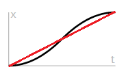

参考类库    
HFF-Code-CSharp.dll（2853 KB，2021-10-11）    
Assembly-CSharp.dll（2388 KB，2022-04-13）    
     
使用 Ctrl + F 搜索    
    
$\color{red} {red} $

<table>
    <tr>
        <th width="60">序号</th>
        <th width="200">组件名</th>
        <th width="600">描述</th>
    </tr>
    <tr>
        <td colspan="3">Signal系列</td>
    </tr>
    <tr>
        <td>1</td>
        <td>Signal Accumulate IReset接口</td>
        <td>数值累计。 每秒累计output：input × CPS。勾选clamp max(min)，则当累计到max(min) value时停止累计；勾选reset，则可以RESET。当RESET时，清零累计数值。</td>
    </tr>
    <tr>
        <td>2</td>
        <td>Signal Add Impulse</td>
        <td>添加瞬时力。 
当input有信号时，给body施加一个延force向量方向，绕torque向量的力；勾选AITC，则该力也将作用于body的子物体。（该力只能触发一次）
    </td>
    </tr>
    <tr>
        <td>3</td>
        <td>Signal Angle</td>
        <td>角度→信号。 
将joint的旋转角度限制在from angle~to angle之间，并将from angle~to angle的角度线性对应到0~1（勾选signed output则为-1~1）上输出。
</td>
    </tr>
    <tr>
        <td>4</td>
        <td>Signal Angular Velocity</td>
        <td>角速度→信号。 
FV, FDV, TDV, TV将输出数值的-1~1分成了三部分 
①当FV ≤ 角速度 ≤ FDV时：随着角速度增大，输出将由-1逐渐变为0； 
②当FDV ≤ 角速度 ≤ TDV时：随着角速度增大，输出将始终保持0； 
③当TDV ≤ 角速度 ≤ TV时：随着角速度增大，输出将由0逐渐变为1。 
即： 
当物体角速度 < FDV时： 
输出：-InverseLerp(FDV, FV, 物体角速度) 
当物体角速度 > TDV时： 
输出：InverseLerp(TDV, TV, 物体角速度) 
（InverseLerp计算公式见下方） 
若想消除②，只需让FDV = TDV = 0即可，此时0~TV将线性对应-1~1，不会在0处停留。
</td>
    </tr>
    <tr>
        <td>5</td>
        <td>Signal Animate</td>
        <td>播放动画。 
（使用事件代替）</td>
    </tr>
    <tr>
        <td>6</td>
        <td>Signal Average</td>
        <td>信号平均值。 
（使用SignalCombine&lt;Sum&gt;和div代替）</td>
    </tr>
    <tr>
        <td>7</td>
        <td>Signal Base IReset接口
        </td>
        <td>signal基类。</td>
    </tr>
    <tr>
        <td>8</td>
        <td>Signal Broadcast Angle</td>
        <td>设置角度。 
（使用signal angle代替）</td>
    </tr>
    <tr>
        <td>9</td>
        <td>Signal Broadcast Angular Velocity</td>
        <td>设置角速度。 
（使用signal angular velocity代替）</td>
    </tr>
    <tr>
        <td>10</td>
        <td>Signal Broadcast Look Angle On Grab</td>
        <td></td>
    </tr>
    <tr>
        <td>11</td>
        <td>Signal Button</td>
        <td>按钮信号。 
（使用button代替）</td>
    </tr>
    <tr>
        <td>12</td>
        <td>Signal Cheat</td>
        <td></td>
    </tr>
    <tr>
        <td>13</td>
        <td>Signal Checkpoint 
        IReset接口
        </td>
        <td>（理论上是踩过哪个点就输出那个点的序号，实测不能用）
        </td>
    </tr>
    <tr>
        <td>14</td>
        <td>Signal Combine</td>
        <td>信号组合。 
（使用SignalCombine代替）</td>
    </tr>
    <tr>
        <td>15</td>
        <td>Signal Distance</td>
        <td>物体距离。 
输出：Transform 1到Transform 2的距离</td>
    </tr>
    <tr>
        <td>16</td>
        <td>Signal Emission</td>
        <td>设置材质自发光参数。 
（使用Lerp Emission代替）</td>
    </tr>
    <tr>
        <td>17</td>
        <td>Signal Hit Rot Limit</td>
        <td>旋转到位检测。 
物体绕设定轴旋转至rotation target±degree of accuracy范围内时，将输出一信号脉冲。 
勾选always check将始终检测，否则将由begin checking信号开启检测；（once only没用）；勾选repeated check将只触发一次，否则可反复触发。</td>
    </tr>
    <tr>
        <td>18</td>
        <td>Signal Hit Trans Limit</td>
        <td>位移到位检测。 
物体延设定轴移动至target position ± 0.005范围内时，将输出1。（translation amount没用）；勾选once only触发后将始终保持输出1。</td>
    </tr>
    <tr>
        <td>19</td>
        <td>Signal Hold</td>
        <td>保持输出。 
input有信号时，立刻有输出，并且该输出保持delay秒。</td>
    </tr>
    <tr>
        <td>20</td>
        <td>Signal Latch IReset接口
        </td>
        <td>信号锁存。 
latch有效时output将锁定为input的数值。当RESET时解除锁定。</td>
    </tr>
    <tr>
        <td>21</td>
        <td>Signal Lerp Volume</td>
        <td>平滑音量。 
如果input * multiply factor < min threshold，则音量平滑变化至0,否则平滑变化至max volume。 
audio source留空则为该脚本附加的物体。</td>
    </tr>
    <tr>
        <td>22</td>
        <td>Signal Light</td>
        <td>设置光强度。 
（使用Lerp Light Intensity代替）</td>
    </tr>
    <tr>
        <td>23</td>
        <td>Signal Loop</td>
        <td></td>
    </tr>
    <tr>
        <td>24</td>
        <td>Signal Manager</td>
        <td>信号管理器。 
别用！！！</td>
    </tr>
    <tr>
        <td>25</td>
        <td>Signal Multiply</td>
        <td>信号乘法。 
（使用SignalCombine&lt;Mul&gt;代替）</td>
    </tr>
    <tr>
        <td>26</td>
        <td>Signal On Displace</td>
        <td>（使用Break On Displacement代替）</td>
    </tr>
    <tr>
        <td>27</td>
        <td>Signal Once IReset接口
        </td>
        <td>单次信号。 
如果input有效，若勾选latch，输出：input（并保持）；否则输出不保持。output只在input首次有信号时输出，之后需要reset信号重置或RESET重置（勾选dont reset时RESET无效，但不影响reset信号）。</td>
    </tr>
    <tr>
        <td>28</td>
        <td>Signal Play Animation</td>
        <td>播放动画。 
（使用事件代替）</td>
    </tr>
    <tr>
        <td>29</td>
        <td>Signal Script Crumbling Floor WS1</td>
        <td>掉落板组件。 
运行时会自动添加刚体和左右两个轴。stand time站立掉落时间；hang time抓着掉落时间；break force直接砸毁力度；left(right) joint broken左右轴断裂信号输出。</td>
    </tr>
    <tr>
        <td>30</td>
        <td>Signal Script Node 1</td>
        <td></td>
    </tr>
    <tr>
        <td>31</td>
        <td>Signal Script Playa Random Sound</td>
        <td>随机播放声音。 
audio clips：声音列表；begin playing有信号时开始播放；set volume不连默认为1；如果有声音正在被播放，sound playing输出1；勾选always play才会播放；（only play when input changed好像没用）。</td>
    </tr>
    <tr>
        <td>32</td>
        <td>Signal Script Set Angular Velocity</td>
        <td>设置角速度。 
（使用Signal Set Angular Velocity代替）</td>
    </tr>
    <tr>
        <td>33</td>
        <td>Signal Script Set Motor Target Velocity 1</td>
        <td></td>
    </tr>
    <tr>
        <td>34</td>
        <td>Signal Script Trigger Sound 1 IReset接口</td>
        <td></td>
    </tr>
    <tr>
        <td>35</td>
        <td>Signal Servo Sound</td>
        <td>控制电机声音。 
（用事件代替）</td>
    </tr>
    <tr>
        <td>36</td>
        <td>Signal Set Active 
（无节点图）</td>
        <td>（用有节点图的代替）</td>
    </tr>
    <tr>
        <td>37</td>
        <td>Signal Set Active 
（有节点图）</td>
        <td>激活物体。 
input有信号时启用target物体，否则不启用。</td>
    </tr>
    <tr>
        <td>38</td>
        <td>Signal set Angular Velocity</td>
        <td>信号→角速度。 
给body设置沿joint轴的角速度。若勾选free spin切向力度为max force × input，否则为max force；最大速度为max velocity ×input。（不填trigger signal则infinite torque和powered没用）</td>
    </tr>
    <tr>
        <td>39</td>
        <td>Signal Set Kinematic</td>
        <td>设置Kinematic。 
input有信号时启用body的is kinematic，否则不启用；body留空则为脚本所附加物体。</td>
    </tr>
    <tr>
        <td>40</td>
        <td>Signal Set Kinematic Children</td>
        <td>设置子物体Kinematic。 
input有信号时启用脚本所附加物体及其全部子物体刚体的is kinematic，否则不启用。</td>
    </tr>
    <tr>
        <td>41</td>
        <td>Signal set Rotation</td>
        <td>信号→角度。 
设置物体绕rotation vector向量的旋转角度，大小为multiplier × input。勾选apply to joint则会将此旋转角度应用于物体的Configurable Joint组件（如果有）中的target rotation属性上；勾选incrementl movement（错别字）则当每次input数值发生变化时，角度旋转multiply大小。</td>
    </tr>
    <tr>
        <td>42</td>
        <td>Signal Set Scale</td>
        <td>信号→缩放。 
设置物体的缩放。将input的0~1线性对应到当前scale~target scale，并将其数值应用于物体。</td>
    </tr>
    <tr>
        <td>43</td>
        <td>Signal Set Translation</td>
        <td>信号→位置。 
设置物体的位置。将input的0~1线性对应到当前position~(multiplier * translation vector) ，并将其数值应用于物体。</td>
    </tr>
    <tr>
        <td>44</td>
        <td>Signal Set Volume</td>
        <td>设置音量、音调。 
（使用Lerp Volume和Lerp Pitch代替）</td>
    </tr>
    <tr>
        <td>45</td>
        <td>Signal Sine</td>
        <td>正弦信号。 
（使用SignalMathSin代替）</td>
    </tr>
    <tr>
        <td>46</td>
        <td>Signal Sound</td>
        <td></td>
    </tr>
    <tr>
        <td>47</td>
        <td>Signal Sound Loop External</td>
        <td></td>
    </tr>
    <tr>
        <td>48</td>
        <td>Signal Sound Play Audio Source</td>
        <td>播放声音。 
（使用事件代替）</td>
    </tr>
    <tr>
        <td>49</td>
        <td>Signal Sound Play Random</td>
        <td>随机播放声音。 
（使用Signal Script Playa Random Sound代替）</td>
    </tr>
    <tr>
        <td>50</td>
        <td>Signal Sound Set Audio Source Vol</td>
        <td>设置音量。 
（使用事件代替）</td>
    </tr>
    <tr>
        <td>51</td>
        <td>Signal Sound Trigger One Shot</td>
        <td></td>
    </tr>
    <tr>
        <td>52</td>
        <td>Signal Sound Volume Map</td>
        <td></td>
    </tr>
    <tr>
        <td>53</td>
        <td>Signal Teleport</td>
        <td>传送。 
当trigger teleport有信号时，将object to teleport物体传送至target transform位置。</td>
    </tr>
    <tr>
        <td>54</td>
        <td>Signal Trigger Checkpoint</td>
        <td>强制踩点。 
当trigger checkpoint有信号时，强制触发checkpoint num存档点。</td>
    </tr>
    <tr>
        <td>55</td>
        <td>Signal To Force IReset接口</td>
        <td>添加常力。 
当input有信号时，在body的force position位置给body施加一个大小方向为force to apply的力。不勾选one shot则input有效时该力将持续存在；否则，该力只在input第一次有效时存在一瞬（类似impulse），在RESET后将重置one shot状态，该瞬时力可再次触发。</td>
    </tr>
    <tr>
        <td>56</td>
        <td>Signal Toggle</td>
        <td>信号切换。 
当inputs中任何一个input有效时，output状态将翻转（由0变1，或1变0）</td>
    </tr>
    <tr>
        <td>57</td>
        <td>Signal Translation</td>
        <td>位置→信号。 
将(body的初始位置~距初始位置distance距离的位置)对应到0~1并输出。若不勾选clamp output，则当body距初始位置距离大于distance时，output将按比例线性增加，不会锁定至1。 
（如：物体初始位置(0, 0, 0)，distance=5，则物体处于(0, 0, 1)位置时将输出0.2）</td>
    </tr>
    <tr>
        <td>58</td>
        <td>Signal Treshold（错别字）</td>
        <td>阈值。 
（使用SignalMathThreshold代替）</td>
    </tr>
    <tr>
        <td>59</td>
        <td>Signal Trigger 
（挂物体上叫signal sound trigger）</td>
        <td></td>
    </tr>
    <tr>
        <td>60</td>
        <td>Signal Trigger</td>
        <td>触发器。 
用于检测“Player”标签的一次性trigger（触发了不能复原）（可以用事件调用ResetOutputs()重置输出复原）。</td>
    </tr>
    <tr>
        <td>61</td>
        <td>Signal Tween Base</td>
        <td></td>
    </tr>
    <tr>
        <td>62</td>
        <td>Signal Tween Particles</td>
        <td></td>
    </tr>
    <tr>
        <td>63</td>
        <td>Signal Tween Position</td>
        <td></td>
    </tr>
    <tr>
        <td>64</td>
        <td>Signal Tween Rotation</td>
        <td></td>
    </tr>
    <tr>
        <td>65</td>
        <td>Signal Unity Event IReset接口</td>
        <td>事件。 
input有效时触发Trigger Event()事件，勾选OTO，则该事件只触发一次；RESET时触发Reset Event()并重置OTO状态，Trigger Event()即可再次触发。</td>
    </tr>
    <tr>
        <td>66</td>
        <td>Signal Velocity</td>
        <td>线速度→信号。 
不勾选directional： 
将to dead velocity~to velocity的速度值对应到0~1并输出。 
①0 < body速度 < to dead velocity时：输出始终为0。 
②to dead velocity < body速度 < to velocity时：随着线速度增大，输出将由0逐渐变为1。具体输出为InverseLerp(TDV, TV, 物体线速度) 
（InverseLerp计算公式见下方） 
注：上述body速度指的是body相对于relative body的速度。 
勾选directional： 
勾选哪个轴，输出就为body速度在那个轴上的分量。勾选多个轴则只有最下面的有效（如：勾选XZ，则只计算Z轴速度）；XYZ都不勾选则以不勾选directional计算。</td>
    </tr>
    <tr>
        <td>67</td>
        <td>SignalCombine</td>
        <td>信号组合。 
And（与）：将所有input进行与运算并输出。 
Or（或）：将所有input进行或运算并输出。 
Xor（异或）：将所有input进行异或运算并输出。 
Sum（求和）：将所有input相加并输出。 
Mul（求积）：将所有input相乘并输出。 
Max（取最大值）：输出所有input中的最大值。 
Min（取最小值）：输出所有input中的最小值。 
勾选invert，输出：1 - 上述运算结果</td>
    </tr>
    <tr>
        <td>68</td>
        <td>SignalSmooth</td>
        <td>平滑信号。 
输出从0逐渐变化至input。速度为max speed每秒。 
 
勾选ease：黑色；不勾选：红色。
</td>
    </tr>
    <tr>
        <td>69</td>
        <td>SignalTime IReset接口</td>
        <td>计时器。 
计时过程中output输出计时数值，当计时到max value时，MVR输出1。勾选STOS，则当input有效时开始计时，否则始终计时；勾选PTOSO，则当input信号消失时，暂停计时；勾选RTOSO，则当input信号消失时，停止计时并复位；如果不勾选STOS并且勾选RAMV，那么当计时到max value时，计时器复位并重新计时，同时MVR输出1持续hold time秒；输入并设置ETT，则当output＞对应element n的值时，对应element n信号口输出1。当RESET时，复位计时状态（回到初始状态）。</td>
    </tr>
    <tr>
        <td>70</td>
        <td>SignalMathAbs</td>
        <td>信号绝对值。 
输出：| input |</td>
    </tr>
    <tr>
        <td>71</td>
        <td>SignalMathAdd</td>
        <td>信号加法。 
输出：input 1 + ... + input i</td>
    </tr>
    <tr>
        <td>72</td>
        <td>SignalMathClamp</td>
        <td>信号限制。 
当input ≥ max时。输出：max 
当min < input < max时。输出：input 
当input ≤ min时。输出：min </td>
    </tr>
    <tr>
        <td>73</td>
        <td>SignalMathDiv</td>
        <td>信号除法。 
输出：in1 ÷ in2 </td>
    </tr>
    <tr>
        <td>74</td>
        <td>SignalMathFract</td>
        <td>信号取小数。 
输出：input的小数部分。（输出：input - floor(input) ）</td>
    </tr>
    <tr>
        <td>75</td>
        <td>SignalMathInverseLerp</td>
        <td>信号反线性插值。 
将输入的From~To之间的数线性映射到0~1并输出。
输出：InverseLerp(from, to, input)      （计算方法见文末） 
（如input=1，From=0，To=4，则输出0.25） </td>
    </tr>
    <tr>
        <td>76</td>
        <td>SignalMathInvert</td>
        <td>信号取反。 
勾选binary output：当有信号时输出0；否则输出1。
不勾选BO：输出：1 - input；否则输出1。</td>
    </tr>
    <tr>
        <td>77</td>
        <td>SignalMathLerp</td>
        <td>信号线性插值。 
将输入的0~1之间的数线性映射到From~To并输出。
输出：Lerp(from, to, input)      （计算方法见文末） 
（如input=0.75，From=0，To=4，则输出3） </td>
    </tr>
    <tr>
        <td>78</td>
        <td>SignalMathMul</td>
        <td>信号乘法。 
输出：in1 × in2 </td>
    </tr>
    <tr>
        <td>79</td>
        <td>SignalMathNegate</td>
        <td>信号相反数。 
输出：- input </td>
    </tr>
    <tr>
        <td>80</td>
        <td>SignalMathSin</td>
        <td>信号正弦。 
输出：sin(2π · input) </td>
    </tr>
    <tr>
        <td>81</td>
        <td>SignalMathThreshold</td>
        <td>信号阈值。 
当input > Threshold时输出1；否则输出0。</td>
    </tr>
    <tr>
        <td>82</td>
        <td>SignalMathCompare</td>
        <td>信号比较。 
判断in1 op in2，满足条件output输出1；否则输出0。（InvertedOutput为output逻辑取反） 
op可选： 精确等于、大约等于、不等于、不大约等于、小于、大于、小于等于和大于等于。</td>
    </tr>
    <tr>
        <td>83</td>
        <td>SignalMathInRange</td>
        <td>信号范围。 
当range low ≤ input ≤ range high时。output输出1；否则输出0。（InvertedOutput为output逻辑取反）</td>
    </tr>
    <tr>
        <td>84</td>
        <td>Signal Math Constant</td>
        <td>信号常量。 
Output 0输出：output value 0 
Output 1输出：output value 1 
Output 2输出：output value 2 
Output 3输出：output value 3</td>
    </tr>
    <tr>
        <td colspan="3" bgColor="#71B630">_</td>
    </tr>
    <tr>
        <td>85</td>
        <td></td>
        <td></td>
    </tr>
    <tr>
        <td>86</td>
        <td></td>
        <td></td>
    </tr>
    <tr>
        <td>87</td>
        <td></td>
        <td></td>
    </tr>
    <tr>
        <td>88</td>
        <td></td>
        <td></td>
    </tr>
    <tr>
        <td>89</td>
        <td></td>
        <td></td>
    </tr>
    <tr>
        <td>90</td>
        <td></td>
        <td></td>
    </tr>
    <tr>
        <td>91</td>
        <td></td>
        <td></td>
    </tr>
    <tr>
        <td>92</td>
        <td></td>
        <td></td>
    </tr>
    <tr>
        <td>93</td>
        <td></td>
        <td></td>
    </tr>
    <tr>
        <td>94</td>
        <td></td>
        <td></td>
    </tr>
    <tr>
        <td>95</td>
        <td></td>
        <td></td>
    </tr>
    <tr>
        <td>96</td>
        <td></td>
        <td></td>
    </tr>
    <tr>
        <td>97</td>
        <td></td>
        <td></td>
    </tr>
    <tr>
        <td>98</td>
        <td></td>
        <td></td>
    </tr>
    <tr>
        <td>99</td>
        <td></td>
        <td></td>
    </tr>
    <tr>
        <td>100</td>
        <td></td>
        <td></td>
    </tr>
    <tr>
        <td>101</td>
        <td></td>
        <td></td>
    </tr>
    <tr>
        <td>102</td>
        <td></td>
        <td></td>
    </tr>
    <tr>
        <td>103</td>
        <td></td>
        <td></td>
    </tr>
    <tr>
        <td>104</td>
        <td></td>
        <td></td>
    </tr>
    <tr>
        <td>105</td>
        <td></td>
        <td></td>
    </tr>
    <tr>
        <td>106</td>
        <td></td>
        <td></td>
    </tr>
    <tr>
        <td>107</td>
        <td></td>
        <td></td>
    </tr>
    <tr>
        <td>108</td>
        <td></td>
        <td></td>
    </tr>
    <tr>
        <td>109</td>
        <td></td>
        <td></td>
    </tr>
    <tr>
        <td>110</td>
        <td></td>
        <td></td>
    </tr>
    <tr>
        <td>111</td>
        <td></td>
        <td></td>
    </tr>
    <tr>
        <td>112</td>
        <td></td>
        <td></td>
    </tr>
    <tr>
        <td>113</td>
        <td></td>
        <td></td>
    </tr>
    <tr>
        <td>114</td>
        <td></td>
        <td></td>
    </tr>
    <tr>
        <td>115</td>
        <td></td>
        <td></td>
    </tr>
    <tr>
        <td>116</td>
        <td></td>
        <td></td>
    </tr>
    <tr>
        <td>117</td>
        <td></td>
        <td></td>
    </tr>
    <tr>
        <td>118</td>
        <td></td>
        <td></td>
    </tr>
    <tr>
        <td>119</td>
        <td></td>
        <td></td>
    </tr>
    <tr>
        <td>120</td>
        <td></td>
        <td></td>
    </tr>
    <tr>
        <td>121</td>
        <td></td>
        <td></td>
    </tr>
    <tr>
        <td>122</td>
        <td></td>
        <td></td>
    </tr>
    <tr>
        <td>123</td>
        <td></td>
        <td></td>
    </tr>
    <tr>
        <td>124</td>
        <td></td>
        <td></td>
    </tr>
    <tr>
        <td>125</td>
        <td></td>
        <td></td>
    </tr>
    <tr>
        <td>126</td>
        <td></td>
        <td></td>
    </tr>
    <tr>
        <td>127</td>
        <td></td>
        <td></td>
    </tr>
    <tr>
        <td>128</td>
        <td></td>
        <td></td>
    </tr>
    <tr>
        <td>129</td>
        <td></td>
        <td></td>
    </tr>
    <tr>
        <td>130</td>
        <td></td>
        <td></td>
    </tr>
    <tr>
        <td>131</td>
        <td></td>
        <td></td>
    </tr>
    <tr>
        <td>132</td>
        <td></td>
        <td></td>
    </tr>
    <tr>
        <td>133</td>
        <td></td>
        <td></td>
    </tr>
    <tr>
        <td>134</td>
        <td></td>
        <td></td>
    </tr>
    <tr>
        <td>135</td>
        <td></td>
        <td></td>
    </tr>
    <tr>
        <td>136</td>
        <td></td>
        <td></td>
    </tr>
    <tr>
        <td>137</td>
        <td></td>
        <td></td>
    </tr>
    <tr>
        <td>138</td>
        <td></td>
        <td></td>
    </tr>
    <tr>
        <td>139</td>
        <td></td>
        <td></td>
    </tr>
    <tr>
        <td>140</td>
        <td></td>
        <td></td>
    </tr>
    <tr>
        <td>141</td>
        <td></td>
        <td></td>
    </tr>
    <tr>
        <td>142</td>
        <td></td>
        <td></td>
    </tr>
    <tr>
        <td>143</td>
        <td></td>
        <td></td>
    </tr>
    <tr>
        <td>144</td>
        <td></td>
        <td></td>
    </tr>
    <tr>
        <td>145</td>
        <td></td>
        <td></td>
    </tr>
    <tr>
        <td>146</td>
        <td></td>
        <td></td>
    </tr>
    <tr>
        <td>147</td>
        <td></td>
        <td></td>
    </tr>
    <tr>
        <td>148</td>
        <td></td>
        <td></td>
    </tr>
    <tr>
        <td>149</td>
        <td></td>
        <td></td>
    </tr>
    <tr>
        <td>150</td>
        <td></td>
        <td></td>
    </tr>
    <tr>
        <td>151</td>
        <td></td>
        <td></td>
    </tr>
    <tr>
        <td>152</td>
        <td></td>
        <td></td>
    </tr>
    <tr>
        <td>153</td>
        <td></td>
        <td></td>
    </tr>
    <tr>
        <td>154</td>
        <td></td>
        <td></td>
    </tr>
    <tr>
        <td>155</td>
        <td></td>
        <td></td>
    </tr>
    <tr>
        <td>156</td>
        <td></td>
        <td></td>
    </tr>
    <tr>
        <td>157</td>
        <td></td>
        <td></td>
    </tr>
    <tr>
        <td>158</td>
        <td></td>
        <td></td>
    </tr>
    <tr>
        <td>159</td>
        <td></td>
        <td></td>
    </tr>
    <tr>
        <td>160</td>
        <td></td>
        <td></td>
    </tr>
    <tr>
        <td>161</td>
        <td></td>
        <td></td>
    </tr>
    <tr>
        <td>162</td>
        <td></td>
        <td></td>
    </tr>
    <tr>
        <td>163</td>
        <td></td>
        <td></td>
    </tr>
    <tr>
        <td>164</td>
        <td></td>
        <td></td>
    </tr>
    <tr>
        <td>165</td>
        <td></td>
        <td></td>
    </tr>
    <tr>
        <td>166</td>
        <td></td>
        <td></td>
    </tr>
    <tr>
        <td>167</td>
        <td></td>
        <td></td>
    </tr>
    <tr>
        <td>168</td>
        <td></td>
        <td></td>
    </tr>
    <tr>
        <td>169</td>
        <td></td>
        <td></td>
    </tr>
    <tr>
        <td>170</td>
        <td></td>
        <td></td>
    </tr>
    <tr>
        <td>171</td>
        <td></td>
        <td></td>
    </tr>
    <tr>
        <td>172</td>
        <td></td>
        <td></td>
    </tr>
    <tr>
        <td>173</td>
        <td></td>
        <td></td>
    </tr>
    <tr>
        <td>174</td>
        <td></td>
        <td></td>
    </tr>
    <tr>
        <td>175</td>
        <td></td>
        <td></td>
    </tr>
    <tr>
        <td>176</td>
        <td></td>
        <td></td>
    </tr>
    <tr>
        <td>177</td>
        <td></td>
        <td></td>
    </tr>
    <tr>
        <td>178</td>
        <td></td>
        <td></td>
    </tr>
    <tr>
        <td>179</td>
        <td></td>
        <td></td>
    </tr>
    <tr>
        <td>180</td>
        <td></td>
        <td></td>
    </tr>
    <tr>
        <td>181</td>
        <td></td>
        <td></td>
    </tr>
    <tr>
        <td>182</td>
        <td></td>
        <td></td>
    </tr>
    <tr>
        <td>183</td>
        <td></td>
        <td></td>
    </tr>
    <tr>
        <td>184</td>
        <td></td>
        <td></td>
    </tr>
    <tr>
        <td>185</td>
        <td></td>
        <td></td>
    </tr>
    <tr>
        <td>186</td>
        <td></td>
        <td></td>
    </tr>
    <tr>
        <td>187</td>
        <td></td>
        <td></td>
    </tr>
    <tr>
        <td>188</td>
        <td></td>
        <td></td>
    </tr>
    <tr>
        <td>189</td>
        <td></td>
        <td></td>
    </tr>
    <tr>
        <td>190</td>
        <td></td>
        <td></td>
    </tr>
        <tr>
        <td colspan="3" bgColor="#4B90E2">rooftop更新后新增</td>
    </tr>
    <tr>
        <td>191</td>
        <td></td>
        <td></td>
    </tr>
    <tr>
        <td>192</td>
        <td></td>
        <td></td>
    </tr>
    <tr>
        <td>193</td>
        <td></td>
        <td></td>
    </tr>
    <tr>
        <td>194</td>
        <td></td>
        <td></td>
    </tr>
    <tr>
        <td>195</td>
        <td></td>
        <td></td>
    </tr>
    <tr>
        <td>196</td>
        <td></td>
        <td></td>
    </tr>
    <tr>
        <td>197</td>
        <td></td>
        <td></td>
    </tr>
    <tr>
        <td>198</td>
        <td></td>
        <td></td>
    </tr>
    <tr>
        <td>199</td>
        <td></td>
        <td></td>
    </tr>
    <tr>
        <td>200</td>
        <td></td>
        <td></td>
    </tr>
    <tr>
        <td>201</td>
        <td></td>
        <td></td>
    </tr>
    <tr>
        <td>202</td>
        <td></td>
        <td></td>
    </tr>
    <tr>
        <td>203</td>
        <td></td>
        <td></td>
    </tr>
    <tr>
        <td>204</td>
        <td></td>
        <td></td>
    </tr>
    <tr>
        <td>205</td>
        <td></td>
        <td></td>
    </tr>
    <tr>
        <td>206</td>
        <td></td>
        <td></td>
    </tr>
    <tr>
        <td>207</td>
        <td></td>
        <td></td>
    </tr>
    <tr>
        <td>208</td>
        <td></td>
        <td></td>
    </tr>
    <tr>
        <td>209</td>
        <td></td>
        <td></td>
    </tr>
    <tr>
        <td>210</td>
        <td></td>
        <td></td>
    </tr>
    </tr>
        <tr>
        <td colspan="3" bgColor="#4B90E2">forest更新后新增</td>
    </tr>
    <tr>
        <td>211</td>
        <td></td>
        <td></td>
    </tr>
    </tr>
        <tr>
        <td colspan="3" bgColor="#4B90E2">lab更新后新增</td>
    </tr>
    <tr>
        <td>212</td>
        <td></td>
        <td></td>
    </tr>
    <tr>
        <td>213</td>
        <td></td>
        <td></td>
    </tr>
    <tr>
        <td>214</td>
        <td></td>
        <td></td>
    </tr>
    <tr>
        <td>215</td>
        <td></td>
        <td></td>
    </tr>
    <tr>
        <td>216</td>
        <td></td>
        <td></td>
    </tr>
    <tr>
        <td>217</td>
        <td></td>
        <td></td>
    </tr>
    <tr>
        <td>218</td>
        <td></td>
        <td></td>
    </tr>
    <tr>
        <td>219</td>
        <td></td>
        <td></td>
    </tr>
    <tr>
        <td>220</td>
        <td></td>
        <td></td>
    </tr>
    <tr>
        <td>221</td>
        <td></td>
        <td></td>
    </tr>
    <tr>
        <td>222</td>
        <td></td>
        <td></td>
    </tr>
    <tr>
        <td>223</td>
        <td></td>
        <td></td>
    </tr>
    </tr>
        <tr>
        <td colspan="3" bgColor="#4B90E2">red rock更新后新增</td>
    </tr>
    <tr>
        <td>224</td>
        <td></td>
        <td></td>
    </tr>
    <tr>
        <td>225</td>
        <td></td>
        <td></td>
    </tr>   
</table>
