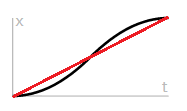
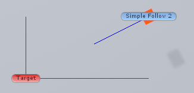

参考类库    
HFF-Code-CSharp.dll（2853 KB，2021-10-11）    
Assembly-CSharp.dll（2491 KB，2024-09-12） 

一些脚本只存在于游戏中的Assembly-CSharp.dll中，并不在Unity中的HFF-Code-CSharp.dll中，你可以在ScriptNotInHFF目录中找到它们，并手动添加至你的Unity工程中，即可正常使用和导出。

使用 Ctrl + F 搜索

<table>
    <tr>
        <th width="60">序号</th>
        <th width="200">组件名</th>
        <th width="600">描述</th>
    </tr>
    <tr>
        <td colspan="3">Signal系列</td>
    </tr>
    <tr>
        <td>1</td>
        <td>Signal Accumulate IReset接口</td>
        <td>数值累计。 每秒累计output：input × CPS。勾选clamp max(min)，则当累计到max(min) value时停止累计；勾选reset，则可以RESET。当RESET时，清零累计数值。</td>
    </tr>
    <tr>
        <td>2</td>
        <td>Signal Add Impulse</td>
        <td>添加瞬时力。 
当input有信号时，给body施加一个延force向量方向，绕torque向量的力；勾选AITC，则该力也将作用于body的子物体。（该力只能触发一次）
    </td>
    </tr>
    <tr>
        <td>3</td>
        <td>Signal Angle</td>
        <td>角度→信号。 
将joint的旋转角度限制在from angle~to angle之间，并将from angle~to angle的角度线性对应到0~1（勾选signed output则为-1~1）上输出。
</td>
    </tr>
    <tr>
        <td>4</td>
        <td>Signal Angular Velocity</td>
        <td>角速度→信号。 
FV, FDV, TDV, TV将输出数值的-1~1分成了三部分 
①当FV ≤ 角速度 ≤ FDV时：随着角速度增大，输出将由-1逐渐变为0； 
②当FDV ≤ 角速度 ≤ TDV时：随着角速度增大，输出将始终保持0； 
③当TDV ≤ 角速度 ≤ TV时：随着角速度增大，输出将由0逐渐变为1。 
即： 
当物体角速度 < FDV时： 
输出：-InverseLerp(FDV, FV, 物体角速度) 
当物体角速度 > TDV时： 
输出：InverseLerp(TDV, TV, 物体角速度) 
（InverseLerp计算公式见下方） 
若想消除②，只需让FDV = TDV = 0即可，此时0~TV将线性对应-1~1，不会在0处停留。
</td>
    </tr>
    <tr>
        <td>5</td>
        <td>Signal Animate</td>
        <td>播放动画。 
（使用事件代替）</td>
    </tr>
    <tr>
        <td>6</td>
        <td>Signal Average</td>
        <td>信号平均值。 
（使用SignalCombine&lt;Sum&gt;和div代替）</td>
    </tr>
    <tr>
        <td>7</td>
        <td>Signal Base IReset接口
        </td>
        <td>signal基类。</td>
    </tr>
    <tr>
        <td>8</td>
        <td>Signal Broadcast Angle</td>
        <td>设置角度。 
（使用signal angle代替）</td>
    </tr>
    <tr>
        <td>9</td>
        <td>Signal Broadcast Angular Velocity</td>
        <td>设置角速度。 
（使用signal angular velocity代替）</td>
    </tr>
    <tr>
        <td>10</td>
        <td>Signal Broadcast Look Angle On Grab</td>
        <td></td>
    </tr>
    <tr>
        <td>11</td>
        <td>Signal Button</td>
        <td>按钮信号。 
（使用button代替）</td>
    </tr>
    <tr>
        <td>12</td>
        <td>Signal Cheat</td>
        <td></td>
    </tr>
    <tr>
        <td>13</td>
        <td>Signal Checkpoint 
        IReset接口
        </td>
        <td>（理论上是踩过哪个点就输出那个点的序号，实测不能用）
        </td>
    </tr>
    <tr>
        <td>14</td>
        <td>Signal Combine</td>
        <td>信号组合。 
（使用SignalCombine代替）</td>
    </tr>
    <tr>
        <td>15</td>
        <td>Signal Distance</td>
        <td>物体距离。 
输出：Transform 1到Transform 2的距离</td>
    </tr>
    <tr>
        <td>16</td>
        <td>Signal Emission</td>
        <td>设置材质自发光参数。 
（使用Lerp Emission代替）</td>
    </tr>
    <tr>
        <td>17</td>
        <td>Signal Hit Rot Limit</td>
        <td>旋转到位检测。 
物体绕设定轴旋转至rotation target±degree of accuracy范围内时，将输出一信号脉冲。 
勾选always check将始终检测，否则将由begin checking信号开启检测；（once only没用）；勾选repeated check将只触发一次，否则可反复触发。</td>
    </tr>
    <tr>
        <td>18</td>
        <td>Signal Hit Trans Limit</td>
        <td>位移到位检测。 
物体延设定轴移动至target position ± 0.005范围内时，将输出1。（translation amount没用）；勾选once only触发后将始终保持输出1。</td>
    </tr>
    <tr>
        <td>19</td>
        <td>Signal Hold</td>
        <td>保持输出。 
input有信号时，立刻有输出，并且该输出保持delay秒。</td>
    </tr>
    <tr>
        <td>20</td>
        <td>Signal Latch IReset接口
        </td>
        <td>信号锁存。 
latch有效时output将锁定为input的数值。当RESET时解除锁定。</td>
    </tr>
    <tr>
        <td>21</td>
        <td>Signal Lerp Volume</td>
        <td>平滑音量。 
如果input * multiply factor < min threshold，则音量平滑变化至0,否则平滑变化至max volume。 
audio source留空则为该脚本附加的物体。</td>
    </tr>
    <tr>
        <td>22</td>
        <td>Signal Light</td>
        <td>设置光强度。 
（使用Lerp Light Intensity代替）</td>
    </tr>
    <tr>
        <td>23</td>
        <td>Signal Loop</td>
        <td></td>
    </tr>
    <tr>
        <td>24</td>
        <td>Signal Manager</td>
        <td>信号管理器。 
别用！！！</td>
    </tr>
    <tr>
        <td>25</td>
        <td>Signal Multiply</td>
        <td>信号乘法。 
（使用SignalCombine&lt;Mul&gt;代替）</td>
    </tr>
    <tr>
        <td>26</td>
        <td>Signal On Displace</td>
        <td>（使用Break On Displacement代替）</td>
    </tr>
    <tr>
        <td>27</td>
        <td>Signal Once IReset接口
        </td>
        <td>单次信号。 
如果input有效，若勾选latch，输出：input（并保持）；否则输出不保持。output只在input首次有信号时输出，之后需要reset信号重置或RESET重置（勾选dont reset时RESET无效，但不影响reset信号）。</td>
    </tr>
    <tr>
        <td>28</td>
        <td>Signal Play Animation</td>
        <td>播放动画。 
（使用事件代替）</td>
    </tr>
    <tr>
        <td>29</td>
        <td>Signal Script Crumbling Floor WS1</td>
        <td>掉落板组件。 
运行时会自动添加刚体和左右两个轴。stand time站立掉落时间；hang time抓着掉落时间；break force直接砸毁力度；left(right) joint broken左右轴断裂信号输出。</td>
    </tr>
    <tr>
        <td>30</td>
        <td>Signal Script Node 1</td>
        <td></td>
    </tr>
    <tr>
        <td>31</td>
        <td>Signal Script Playa Random Sound</td>
        <td>随机播放声音。 
audio clips：声音列表；begin playing有信号时开始播放；set volume不连默认为1；如果有声音正在被播放，sound playing输出1；勾选always play才会播放；（only play when input changed好像没用）。</td>
    </tr>
    <tr>
        <td>32</td>
        <td>Signal Script Set Angular Velocity</td>
        <td>设置角速度。 
（使用Signal Set Angular Velocity代替）</td>
    </tr>
    <tr>
        <td>33</td>
        <td>Signal Script Set Motor Target Velocity 1</td>
        <td></td>
    </tr>
    <tr>
        <td>34</td>
        <td>Signal Script Trigger Sound 1 IReset接口</td>
        <td></td>
    </tr>
    <tr>
        <td>35</td>
        <td>Signal Servo Sound</td>
        <td>控制电机声音。 
（用事件代替）</td>
    </tr>
    <tr>
        <td>36</td>
        <td>Signal Set Active 
（无节点图）</td>
        <td>（用有节点图的代替）</td>
    </tr>
    <tr>
        <td>37</td>
        <td>Signal Set Active 
（有节点图）</td>
        <td>激活物体。 
input有信号时启用target物体，否则不启用。</td>
    </tr>
    <tr>
        <td>38</td>
        <td>Signal set Angular Velocity</td>
        <td>信号→角速度。 
给body设置沿joint轴的角速度。若勾选free spin切向力度为max force × input，否则为max force；最大速度为max velocity ×input。（不填trigger signal则infinite torque和powered没用）</td>
    </tr>
    <tr>
        <td>39</td>
        <td>Signal Set Kinematic</td>
        <td>设置Kinematic。 
input有信号时启用body的is kinematic，否则不启用；body留空则为脚本所附加物体。</td>
    </tr>
    <tr>
        <td>40</td>
        <td>Signal Set Kinematic Children</td>
        <td>设置子物体Kinematic。 
input有信号时启用脚本所附加物体及其全部子物体刚体的is kinematic，否则不启用。</td>
    </tr>
    <tr>
        <td>41</td>
        <td>Signal set Rotation</td>
        <td>信号→角度。 
设置物体绕rotation vector向量的旋转角度，大小为multiplier × input。勾选apply to joint则会将此旋转角度应用于物体的Configurable Joint组件（如果有）中的target rotation属性上；勾选incrementl movement（错别字）则当每次input数值发生变化时，角度旋转multiply大小。</td>
    </tr>
    <tr>
        <td>42</td>
        <td>Signal Set Scale</td>
        <td>信号→缩放。 
设置物体的缩放。将input的0~1线性对应到当前scale~target scale，并将其数值应用于物体。</td>
    </tr>
    <tr>
        <td>43</td>
        <td>Signal Set Translation</td>
        <td>信号→位置。 
设置物体的位置。将input的0~1线性对应到当前position~(multiplier * translation vector) ，并将其数值应用于物体。</td>
    </tr>
    <tr>
        <td>44</td>
        <td>Signal Set Volume</td>
        <td>设置音量、音调。 
（使用Lerp Volume和Lerp Pitch代替）</td>
    </tr>
    <tr>
        <td>45</td>
        <td>Signal Sine</td>
        <td>正弦信号。 
（使用SignalMathSin代替）</td>
    </tr>
    <tr>
        <td>46</td>
        <td>Signal Sound</td>
        <td></td>
    </tr>
    <tr>
        <td>47</td>
        <td>Signal Sound Loop External</td>
        <td></td>
    </tr>
    <tr>
        <td>48</td>
        <td>Signal Sound Play Audio Source</td>
        <td>播放声音。 
（使用事件代替）</td>
    </tr>
    <tr>
        <td>49</td>
        <td>Signal Sound Play Random</td>
        <td>随机播放声音。 
（使用Signal Script Playa Random Sound代替）</td>
    </tr>
    <tr>
        <td>50</td>
        <td>Signal Sound Set Audio Source Vol</td>
        <td>设置音量。 
（使用事件代替）</td>
    </tr>
    <tr>
        <td>51</td>
        <td>Signal Sound Trigger One Shot</td>
        <td></td>
    </tr>
    <tr>
        <td>52</td>
        <td>Signal Sound Volume Map</td>
        <td></td>
    </tr>
    <tr>
        <td>53</td>
        <td>Signal Teleport</td>
        <td>传送。 
当trigger teleport有信号时，将object to teleport物体传送至target transform位置。</td>
    </tr>
    <tr>
        <td>54</td>
        <td>Signal Trigger Checkpoint</td>
        <td>强制踩点。 
当trigger checkpoint有信号时，强制触发checkpoint num存档点。</td>
    </tr>
    <tr>
        <td>55</td>
        <td>Signal To Force IReset接口</td>
        <td>添加常力。 
当input有信号时，在body的force position位置给body施加一个大小方向为force to apply的力。不勾选one shot则input有效时该力将持续存在；否则，该力只在input第一次有效时存在一瞬（类似impulse），在RESET后将重置one shot状态，该瞬时力可再次触发。</td>
    </tr>
    <tr>
        <td>56</td>
        <td>Signal Toggle</td>
        <td>信号切换。 
当inputs中任何一个input有效时，output状态将翻转（由0变1，或1变0）</td>
    </tr>
    <tr>
        <td>57</td>
        <td>Signal Translation</td>
        <td>位置→信号。 
将(body的初始位置~距初始位置distance距离的位置)对应到0~1并输出。若不勾选clamp output，则当body距初始位置距离大于distance时，output将按比例线性增加，不会锁定至1。 
（如：物体初始位置(0, 0, 0)，distance=5，则物体处于(0, 0, 1)位置时将输出0.2）</td>
    </tr>
    <tr>
        <td>58</td>
        <td>Signal Treshold（错别字）</td>
        <td>阈值。 
（使用SignalMathThreshold代替）</td>
    </tr>
    <tr>
        <td>59</td>
        <td>Signal Trigger 
（挂物体上叫signal sound trigger）</td>
        <td></td>
    </tr>
    <tr>
        <td>60</td>
        <td>Signal Trigger</td>
        <td>触发器。 
用于检测“Player”标签的一次性trigger（触发了不能复原）（可以用事件调用ResetOutputs()重置输出复原）。</td>
    </tr>
    <tr>
        <td>61</td>
        <td>Signal Tween Base</td>
        <td></td>
    </tr>
    <tr>
        <td>62</td>
        <td>Signal Tween Particles</td>
        <td></td>
    </tr>
    <tr>
        <td>63</td>
        <td>Signal Tween Position</td>
        <td></td>
    </tr>
    <tr>
        <td>64</td>
        <td>Signal Tween Rotation</td>
        <td></td>
    </tr>
    <tr>
        <td>65</td>
        <td>Signal Unity Event IReset接口</td>
        <td>事件。 
input有效时触发Trigger Event()事件，勾选OTO，则该事件只触发一次；RESET时触发Reset Event()并重置OTO状态，Trigger Event()即可再次触发。</td>
    </tr>
    <tr>
        <td>66</td>
        <td>Signal Velocity</td>
        <td>线速度→信号。 
不勾选directional： 
将to dead velocity~to velocity的速度值对应到0~1并输出。 
①0 < body速度 < to dead velocity时：输出始终为0。 
②to dead velocity < body速度 < to velocity时：随着线速度增大，输出将由0逐渐变为1。具体输出为InverseLerp(TDV, TV, 物体线速度) 
（InverseLerp计算公式见下方） 
注：上述body速度指的是body相对于relative body的速度。 
勾选directional： 
勾选哪个轴，输出就为body速度在那个轴上的分量。勾选多个轴则只有最下面的有效（如：勾选XZ，则只计算Z轴速度）；XYZ都不勾选则以不勾选directional计算。</td>
    </tr>
    <tr>
        <td>67</td>
        <td>SignalCombine</td>
        <td>信号组合。 
And（与）：将所有input进行与运算并输出。 
Or（或）：将所有input进行或运算并输出。 
Xor（异或）：将所有input进行异或运算并输出。 
Sum（求和）：将所有input相加并输出。 
Mul（求积）：将所有input相乘并输出。 
Max（取最大值）：输出所有input中的最大值。 
Min（取最小值）：输出所有input中的最小值。 
勾选invert，输出：1 - 上述运算结果</td>
    </tr>
    <tr>
        <td>68</td>
        <td>SignalSmooth</td>
        <td>平滑信号。 
输出从0逐渐变化至input。速度为max speed每秒。 
 
勾选ease：黑色；不勾选：红色。
</td>
    </tr>
    <tr>
        <td>69</td>
        <td>SignalTime IReset接口</td>
        <td>计时器。 
计时过程中output输出计时数值，当计时到max value时，MVR输出1。勾选STOS，则当input有效时开始计时，否则始终计时；勾选PTOSO，则当input信号消失时，暂停计时；勾选RTOSO，则当input信号消失时，停止计时并复位；如果不勾选STOS并且勾选RAMV，那么当计时到max value时，计时器复位并重新计时，同时MVR输出1持续hold time秒；输入并设置ETT，则当output＞对应element n的值时，对应element n信号口输出1。当RESET时，复位计时状态（回到初始状态）。</td>
    </tr>
    <tr>
        <td>70</td>
        <td>SignalMathAbs</td>
        <td>信号绝对值。 
输出：| input |</td>
    </tr>
    <tr>
        <td>71</td>
        <td>SignalMathAdd</td>
        <td>信号加法。 
输出：input 1 + ... + input i</td>
    </tr>
    <tr>
        <td>72</td>
        <td>SignalMathClamp</td>
        <td>信号限制。 
当input ≥ max时。输出：max 
当min < input < max时。输出：input 
当input ≤ min时。输出：min </td>
    </tr>
    <tr>
        <td>73</td>
        <td>SignalMathDiv</td>
        <td>信号除法。 
输出：in1 ÷ in2 </td>
    </tr>
    <tr>
        <td>74</td>
        <td>SignalMathFract</td>
        <td>信号取小数。 
输出：input的小数部分。（输出：input - floor(input) ）</td>
    </tr>
    <tr>
        <td>75</td>
        <td>SignalMathInverseLerp</td>
        <td>信号反线性插值。 
将输入的From~To之间的数线性映射到0~1并输出。
输出：InverseLerp(from, to, input)      （计算方法见文末） 
（如input=1，From=0，To=4，则输出0.25） </td>
    </tr>
    <tr>
        <td>76</td>
        <td>SignalMathInvert</td>
        <td>信号取反。 
勾选binary output：当有信号时输出0；否则输出1。
不勾选BO：输出：1 - input；否则输出1。</td>
    </tr>
    <tr>
        <td>77</td>
        <td>SignalMathLerp</td>
        <td>信号线性插值。 
将输入的0~1之间的数线性映射到From~To并输出。
输出：Lerp(from, to, input)      （计算方法见文末） 
（如input=0.75，From=0，To=4，则输出3） </td>
    </tr>
    <tr>
        <td>78</td>
        <td>SignalMathMul</td>
        <td>信号乘法。 
输出：in1 × in2 </td>
    </tr>
    <tr>
        <td>79</td>
        <td>SignalMathNegate</td>
        <td>信号相反数。 
输出：- input </td>
    </tr>
    <tr>
        <td>80</td>
        <td>SignalMathSin</td>
        <td>信号正弦。 
输出：sin(2π · input) </td>
    </tr>
    <tr>
        <td>81</td>
        <td>SignalMathThreshold</td>
        <td>信号阈值。 
当input > Threshold时输出1；否则输出0。</td>
    </tr>
    <tr>
        <td>82</td>
        <td>SignalMathCompare</td>
        <td>信号比较。 
判断in1 op in2，满足条件output输出1；否则输出0。（InvertedOutput为output逻辑取反） 
op可选： 精确等于、大约等于、不等于、不大约等于、小于、大于、小于等于和大于等于。</td>
    </tr>
    <tr>
        <td>83</td>
        <td>SignalMathInRange</td>
        <td>信号范围。 
当range low ≤ input ≤ range high时。output输出1；否则输出0。（InvertedOutput为output逻辑取反）</td>
    </tr>
    <tr>
        <td>84</td>
        <td>Signal Math Constant</td>
        <td>信号常量。 
Output 0输出：output value 0 
Output 1输出：output value 1 
Output 2输出：output value 2 
Output 3输出：output value 3</td>
    </tr>
    <tr>
        <td colspan="3" bgColor="#71B630">_</td>
    </tr>
    <tr>
        <td>85</td>
        <td>Angular Impulse</td>
        <td>角动量（直译）。 
当rigidbody的角速度大于angular velocity threshold时，勾选其刚体is kinematic属性（角速度过大停止移动）。</td>
    </tr>
    <tr>
        <td>86</td>
        <td>Angular Joint</td>
        <td>旋转关节。 
为body设置一个只能旋转的关节。勾选Use Limits，则物体只能在[Min Value, Max Value]区间中自由旋转；Max Speed为最大自动旋转速度；Max Acceleration为最大加速度；勾选Use Spring时，Max Force为电机的驱动力，当该力过小时，可能需要更长时间来达到Max Speed；Spring为该物体回弹至Min Value状态的力，Damper用来限制回弹速度（越大越慢）；Anchor为该物体所连接的物体，必须具有刚体；Axis设定关节的旋转轴，该物体必须是Angular Joint附加物体的子物体，并取其X轴方向作为轴向，不填则为自身X轴方向。勾选Enable Collision则body与anchor之间会发生碰撞，否则不会。（未说明参数无需修改）</td>
    </tr>
    <tr>
        <td>87</td>
        <td>Angular Servo</td>
        <td>（用Servo Motor代替）</td>
    </tr>
    <tr>
        <td>88</td>
        <td>Break On Displacement</td>
        <td>出界信号。 
当物体当前位置与物体起始位置的距离大于Break Displacement时，broken输出1（一次性，无法复位）。</td>
    </tr>
    <tr>
        <td>89</td>
        <td>Break On Impact</td>
        <td>碰撞断裂。 
当Joint To Break所附加物体受到碰撞，且碰撞力度大于Treshold时，Joint To Break将断裂。</td>
    </tr>
    <tr>
        <td>90</td>
        <td>Button</td>
        <td>按钮。（建议使用预制件） 
Button Speed按钮按下速度（越小越慢）；Activation Mode激活模式：Physics物理：只有被完全按下时才会输出信号；Torch触摸：当手触摸时就会输出信号。Button Action按钮行为：Press：信号输出后会始终保持，只有当reset有效时才会复位；Hold：激活时输出，不激活不输出；Toggle：目测和Hold一样；（True When Pressed没用）；勾选Usebuttonaction时Button Action选项才有效。</td>
    </tr>
    <tr>
        <td>91</td>
        <td>Chargeable Battery 电力组件</td>
        <td>充电电池。 
plus、minus为正负极插座；voltage为初始电压；max voltage为充电的最大电压；CPS为每0.5秒充电的电压增量。</td>
    </tr>
    <tr>
        <td>92</td>
        <td>Change Colour</td>
        <td>材质变色。 
事件调用ChangeColourMat()函数可将MTC材质的颜色替换成new color。调用Reset()函数，颜色将换回初始值。</td>
    </tr>
    <tr>
        <td>93</td>
        <td>Charger 电力组件</td>
        <td>充电器（电源）。 
voltage为电源电压；max I为该电源能提供的最大电流；ampers输出当前电流值；charging表示正在给电池充电（做电源时将始终输出1）；充电结束charged输出1。</td>
    </tr>
    <tr>
        <td>94</td>
        <td>Checkpoint</td>
        <td>检查点。 
添加一个保存点，number不重复即可，但当激活某一检查点时，任何小于其number的检查点将会失效。勾选tight spawn，玩家出生位置将会相对紧凑。点击Set as debug spawn point，会将次检查点设置成玩家第一次出生位置（游戏中也会生效）。</td>
    </tr>
    <tr>
        <td>95</td>
        <td>Collision Audio Sensor</td>
        <td>碰撞发声器。 
此脚本所附加的物体发生碰撞时，将在碰撞点发出声音，声音与该物体物理材质有关。</td>
    </tr>
    <tr>
        <td>96</td>
        <td>Constant Force At Point</td>
        <td>添加常力。 
在此脚本所附加的物体中心位置施加一个大小方向为Force的力。</td>
    </tr>
    <tr>
        <td>97</td>
        <td>Contact Signal</td>
        <td>接触传感器。 
当此脚本所附加的物体与contact objects列表中任何一个物体发生接触时，value输出1,；勾选One Shot On则接触后value始终保持1（不可复位）。</td>
    </tr>
    <tr>
        <td>98</td>
        <td>Control From Angle IReset接口</td>
        <td>角度→信号。 
（以下数据只在勾选Calculate Angle Correctly时有效） 
以target的axis轴面向自己为准，顺时针旋转target，输出数值减小，逆时针增大。 
勾选Allow Negative时：（物体初始角度记作A） 
则(A + Range Rotations × 360)~( A - Range Rotations × 360)对应到输出值的-1~1（不勾选为0~1）。 
勾选Clamp Full Rotation，则当角度超出上述区间范围时，将保持最大（小）输出。*注：则当角度超出上述区间范围时，A会向超出方向跟进，跟进大小为超出大小（如：角度向逆时针方向超出30度，则下次计算时A=A-30）。 
勾选RTZOR，则RESET时将输出归0。当RESET时，恢复该物体到初始角度。</td>
    </tr>
    <tr>
        <td>99</td>
        <td>Conveyor</td>
        <td>传送带。 
当input有信号时，传送带开始运行。forward、right为传送带带子的朝向；item prefab为履带片模型；segment count为履带片总数；length为传送带总长度；radius为转角半径；speed为传送带运行速度。</td>
    </tr>
    <tr>
        <td>100</td>
        <td>Deliver Checkpoint</td>
        <td>刚体检查点。 
当Required Bodies中的物体进入该脚本所附加物体的触发范围内，且数量达到Required Count时，该检查点激活。</td>
    </tr>
    <tr>
        <td>101</td>
        <td>Displacement Sensor</td>
        <td>位移传感器。 
输出：物体当前位置到relative to 位置的距离。relative to留空则为物体起始位置。</td>
    </tr>
    <tr>
        <td>102</td>
        <td>Fall Trigger</td>
        <td>死亡点。 
玩家触碰后死亡。</td>
    </tr>
    <tr>
        <td>103</td>
        <td>Fantastic Debug Ray 仅编辑器</td>
        <td>贼棒的调试射线（直译）。 
绘制一条线段，以该脚本所附加的物体中心为起点，length为长度，颜色为color；若勾选local则延物体的Z轴方向，否则延世界的Z轴方向。</td>
    </tr>
    <tr>
        <td>104</td>
        <td>Fantastic Mass Calculator</td>
        <td>贼棒的质量计算器。 
为物体设置质量初值。该质量与物体体积有关。 
质量：Material系数 ÷ 100 × (Scale.X × Scale.Y × Scale.Z) 
Material系数为material条目后边的那个数字，Custom的系数为Custom Density。</td>
    </tr>
    <tr>
        <td>105</td>
        <td>Fantastic Wind</td>
        <td>贼棒的风。 
为物体模拟吹风的效果。blown objects为被吹物体；物体们每隔frame skip帧（一帧FDT秒），有percent chance%的几率受到一个大小在min force到max force范围内，方向为direction的力。</td>
    </tr>
    <tr>
        <td>106</td>
        <td>Fire Correct Velocity</td>
        <td>按速度发射物体。 
在事件中调用Fire()函数，该脚本所附加物体将沿Z轴正方向，初速度为speed被发射出去。</td>
    </tr>
    <tr>
        <td>107</td>
        <td>Flammable 热力组件</td>
        <td>可燃物（被加热物）。 
当该脚本所附加物体进入Flammable Script Heat Source 1物体的collider触发范围时，该物体将被点燃。output输出当前heat值；ignition point为该可燃物燃点，heat大于此值时视为被点燃（当heat再次低于ignition point时，点燃状态也不会改变）；maximum heat为能被加热到的最大热值；heat up speed为该可燃物升温速度。</td>
    </tr>
    <tr>
        <td>108</td>
        <td>Flammable Script Boiler Collider 热力组件</td>
        <td>锅炉触发区。 
当一个物体是触发器并附加该脚本时，那么该脚本的触发区域为Flammable Source Boiler 1的热量计数区。</td>
    </tr>
    <tr>
        <td>109</td>
        <td>Flammable Script Heat Colour Change 1 热力组件</td>
        <td>颜色随温度变化。 
cold color为物体完全冷却时颜色；hot color为物体完全加热时的颜色；emit color、emit intensity为物体完全加热时的自发光颜色和自发光亮度；HUT和CDT为完全加热所需时间和完全冷却所需时间。</td>
    </tr>
    <tr>
        <td>110</td>
        <td>Flammable Script Heat Source 1 热力组件</td>
        <td>热源（加热物）。 
勾选IAH则始终发热；is hot显示当前热源是否发热；在不勾选IAH的情况下，可通过调用Ignite()和Extinguish()来控制其点燃和熄灭。</td>
    </tr>
    <tr>
        <td>111</td>
        <td>Flammable Source Boiler 1 热力组件</td>
        <td>锅炉。 
热量计数器。output输出计数区中点燃的Flammable物体个数 ÷ capacity；flame sound为点燃时的声音，fire volume为音量。</td>
    </tr>
    <tr>
        <td>112</td>
        <td>Floating Mesh</td>
        <td>漂浮物。 
让物体能够漂在水面上。hull为物体与水接触的Collider；mesh为物体的Mesh（不能拖mesh filter，只能在文件中选）；sensor为Water Sensor脚本（漂浮物需要附加该脚本）；density为漂浮物密度（密度越大，水面就越近似于地面）；PL、PS、SL、SS分别为浮力一次项系数、浮力二次项系数、表面张力一次项系数和表面张力二次项系数（类似的计算公式见Water Motor）；falloff power为漂浮晃动速度的衰减力度。</td>
    </tr>
    <tr>
        <td>113</td>
        <td>Foldable Solar Panel</td>
        <td>折叠太阳能板。 
把该脚本所附加物体的Light Consume输出值记作L，left的Z轴方向向量记作VL，right的Z轴方向向量记作VR，该脚本所附加物体的Z轴方向向量记作VB，则： 
输出：(Dot(VL, VB) + Dot(VR, VB)) × L 
（Dot(A, B)含义：如果AB夹角为锐角，等于0；如果AB夹角为钝角，等于0.5）</td>
    </tr>
    <tr>
        <td>114</td>
        <td>Follow Waypoints</td>
        <td>路径点移动。 
当power > 0时，该脚本所附加物体将以speed ×input的速度朝着waypoints中的各个位置移动；当移动到最后一个点时，finished也不会输出1（官方忘了写这个代码）；勾选loop，物体会在waypoints中循环移动；cur point为当前朝向点，不修改默认从Element 0开始运行，设置几就从几开始移动。</td>
    </tr>
    <tr>
        <td>115</td>
        <td>Gap Joint</td>
        <td>双扇门关节。 
同时控制两关节。Joint A、B只需设置物体和方向，其余参数将由Gap Joint的参数平分给定。</td>
    </tr>
    <tr>
        <td>116</td>
        <td>Get Voltage 电力组件</td>
        <td>获取电压值。 
（与Voltage To Signal一样）</td>
    </tr>
    <tr>
        <td>117</td>
        <td>Grab Sensor</td>
        <td>抓握传感器。 
当该脚本所附加物体，能被抓握且被抓握时，输出1；否则输出0。</td>
    </tr>
    <tr>
        <td>118</td>
        <td>Heat To Signal 热力组件</td>
        <td>热量→信号。</td>
    </tr>
    <tr>
        <td>119</td>
        <td>Ignore Collision</td>
        <td>忽略碰撞。 
忽略该脚本所附加物体与colliders to ignore物体之间的碰撞。勾选recursive，则该脚本所附加物体的子物体也将忽略碰撞，否则不忽略。</td>
    </tr>
    <tr>
        <td>120</td>
        <td>Ignore Child Collision</td>
        <td>忽略子物体碰撞。 
忽略该脚本所附加物体与其所有子物体之间的碰撞。</td>
    </tr>
    <tr>
        <td>121</td>
        <td>Item mixer IReset接口</td>
        <td>物品混合器。 
当收集齐一些物品，触发事件。items为待收集物品列表，其中item指定游戏物体，mix effect为添加该物品后对该物体的操作（Destroy混合后销毁、Destroy First添加后销毁、Retain保留），item added()为该物品添加后触发的事件；bad item added()为非待收集物品添加后执行的事件；当items中所有物品添加完成时all items输出1，此时input有信号时，在activation time秒后执行all items added()事件。RESET时，activation time、all items输出清零。</td>
    </tr>
    <tr>
        <td>122</td>
        <td>Joint Sensor</td>
        <td>关节传感器。 
输出Joint Base子类关节的数值。（与Joint同物体才有效） 
value：当前Joint数值，范围Min Value ~ Max Value。 
value normalized：Min Value到Max Value线性对应到0~1后的数值，即InverseLerp(Min Value, Max Value, value)，范围0~1。若勾选signed out，则为InverseLerp(Min Value, Max Value, value) × 2 - 1，范围-1~1。</td>
    </tr>
    <tr>
        <td>123</td>
        <td>Lerp Emission</td>
        <td>信号控制自发光材质。 
当input有信号时，材质的自发光参数将从from变化至to，input值为自发光亮度；当物体附有多个材质时，勾选UMEM，并通过element number指定材质。</td>
    </tr>
    <tr>
        <td>124</td>
        <td>Lerp Light Intensity</td>
        <td>信号控制光强。 
当input有信号时，intensity将从from变化至to。</td>
    </tr>
    <tr>
        <td>125</td>
        <td>Lerp Particles</td>
        <td>信号控制粒子速率。 
当input有信号时，粒子的发射速率从rate off变至rate on，color over life time，从color off 1变至color on 2（color off 2、color on 1没用）。</td>
    </tr>
    <tr>
        <td>126</td>
        <td>Lerp Pitch</td>
        <td>信号控制音调（播放速度） 
当input有信号时，Audio Source中的pitch将从from变化至to。 
pitch数值 = Lerp(from, to, 2 ^ - (input ÷ 1200))。 
例：from = -1200，to = 0。则input处于0~1范围内变化时，pitch会在0.5~1之间变化。 
（其他组件要求：Audio Source）
</td>
    </tr>
    <tr>
        <td>127</td>
        <td>Lever</td>
        <td>拉杆。 
将指定的关节joint或angular joint设为拉杆。from angle~to angle为拉杆的活动范围，其对应的output输出值为-1~1。当勾选discrete时，output只会输出-1和1，拉杆角度位于from angle和from dead angle之间时输出-1，反之输出1；位于from dead angle和to dead angle之间时输出0。勾选snap zero，拉杆则可以吸附至0角度。勾选snap positive，拉杆则可以吸附至to angle角度。勾选snap negative，拉杆则可以吸附至from angle角度。snap to可以为拉杆设置初始吸附位置，当snap to的值小于-0.75、大于-0.5小于0.5、大于0.75时，则会吸附至from angle角度、0角度、to angle角度（只有勾选对应吸附时才会生效）。angle显示当前拉杆角度。
</td>
    </tr>
    <tr>
        <td>128</td>
        <td>Light Consume</td>
        <td>光照传感器。 
在勾选CIUS的情况下： 
当物体0~20%暴露在光源下时，输出0；当物体20~50%暴露在光源下时，输出0.25；当物体50~80%暴露在光源下时，输出0.5；当物体80~100%暴露在光源下时，输出1。（未详细定量计算，仅供参考）（光源要有Sun脚本，物体要有Collider）</td>
    </tr>
    <tr>
        <td>129</td>
        <td>Lightning Renderer</td>
        <td>闪电渲染器。 
生成一道闪电。 
Line Renderer：materials设置闪电材质；取消勾选use world space，则闪电的起始点使用自身坐标系。 
Lightning Renderer：points为闪电段数；step为每段长度；scale设置闪电在各个轴向上的振动幅度；RSMin到RSMax为闪电闪光时间的随机数范围（0~1之间）；DAS为闪电消失前的闪烁次数；勾选AEP则闪电的头尾固定，否则只固定头。</td>
    </tr>
    <tr>
        <td>130</td>
        <td>Light Flicker</td>
        <td>灯光闪烁。 
模拟灯光闪烁，使光源的intensity在min intensity ~ max intensity之间不停变化，变化方式为三个speed产生的正弦波叠加。</td>
    </tr>
    <tr>
        <td>131</td>
        <td>Light Tweek Based On Range</td>
        <td>灯光根据玩家距离变化。 
lights中的light根据玩家相对position 1，position 2的位置，亮度从intensity 1变化至intensity 2。 
位置计算方式：过position 1，position 2做直线，方向规定为从position 1到position 2。将玩家的空间位置投影到该直线上，根据投影点的位置： 
①当投影点位于position 1后方时，light的强度始终为intensity 1 
②当投影点位于position 1和position 2之间时，light的强度为：投影点距position 1的距离 ÷ position 1，position 2之间的距离 × (intensity 2 - intensity 1) 
③当投影点位于position 2前方时，light的强度始终为intensity 2</td>
    </tr>
    <tr>
        <td>132</td>
        <td>Linear Joint</td>
        <td>线性滑动关节。 
为body设置一个只能直线滑动的关节。勾选Use Limits，则物体只能在[Min Value, Max Value]区间中自由移动；Max Speed为最大自动移动速度；Max Acceleration为最大加速度；勾选Use Spring时，Max Force为电机的驱动力，当该力过小时，可能需要更长时间来达到Max Speed；Spring为该物体回弹至Min Value状态的力，Damper用来限制回弹速度（越大越慢）；Anchor为该物体所连接的物体，必须具有刚体；Axis设定关节的移动轴，该物体必须是Linear Joint附加物体的子物体，并取其Z轴方向作为轴向，不填则为自身Z轴方向。勾选Enable Collision则body与anchor之间会发生碰撞，否则不会。</td>
    </tr>
    <tr>
        <td>133</td>
        <td>Linear Servo</td>
        <td>（用Servo Motor或Linear Servo Joint代替）</td>
    </tr>
    <tr>
        <td>134</td>
        <td>Linear Servo Joint</td>
        <td>带电机的线性关节。 
body将在min value到max value之间移动，速度为max speed ×  power × input，加速度为max acceleration。initial value为body的初始位置；max force为电机的驱动力，当该力过小时，可能需要更长时间来达到max speed；reverse delay为反向运动前的切换时间。未勾选signed input，则以min value为起点，否则以(min value + max value) ÷ 2为起点，input小于0向min value移动，input大于0向max value移动。</td>
    </tr>
    <tr>
        <td>135</td>
        <td>Lock Cursor Editor 仅编辑器</td>
        <td>锁定鼠标。 
勾选lock cursor，在未打开Node Window面板运行时，鼠标将锁定至Game面板，按Esc解锁。</td>
    </tr>
    <tr>
        <td>136</td>
        <td>Magnetic Body 磁力组件</td>
        <td>磁体。 
定义此物体为磁体，磁力作用点为Magnetic Point所附加的物体。勾选TVS，则该磁体的磁性由input信号触发；勾选DOC，则该磁体磁性接触其他磁体时消失；勾选FIP，则该物体与BTF（也是磁体）接触TTF秒后，使用一个关节将其连接，不可分开；勾选DOF，则当此物体与BTF接触并固定后，消除该物体磁性。</td>
    </tr>
    <tr>
        <td>137</td>
        <td>Magnetic Point 磁力组件</td>
        <td>磁力点。 
设置磁体的物理属性。magnetism大于0，为N极（红色）；magnetism小于0，为S极（蓝色）；magnetism等于0，为“铁”（白色）；若想触发磁力，磁体还需要有一个带trigger选项的collider，只有当其他磁体进入该磁体range范围并且进入trigger时，磁力才会起作用（建议trigger与range同大小）；MPO为磁力作用点相对物体中心点的偏移位置；angle为该磁力的作用范围，以物体Z轴为轴，angle为顶角的圆锥形区域（曲底圆锥，圆锥与range球的交集区域。编辑器中只显示了两条线。），只有当磁体处于该范围内才会受到磁力作用。</td>
    </tr>
    <tr>
        <td>138</td>
        <td>Mass Change On Grab</td>
        <td>抓握改变质量。 
当rigid被抓握时，将其质量设置为：原质量 × MMOG。</td>
    </tr>
    <tr>
        <td>139</td>
        <td>Melting Object IReset接口</td>
        <td>物体融化。 
该物体受光照融化。融化速度为melting speed秒；该物体完全融化后，间隔respawn delay秒将会重生（如果重生启用）；如果light intensity有信号，将触发该物体融化。output输出已融化百分比。当RESET时，恢复物体初始大小和重量，output置0。</td>
    </tr>
    <tr>
        <td>140</td>
        <td>Net Body</td>
        <td>网络物体同步。 
同步多人游戏下该物体的Transform信息，以及物体重生。物体世界坐标Y值小于despawn height时，物体将会消失，此时，如果勾选respawn，则物体将会重生，重生高度为物体初始位置Y值 + respawn height，同时触发Respawn Event()事件；带有该脚本的物体进行网络同步时会受到一个范围限制（默认值500m），当该物体移动距离超出该限制时，物体位置将不会被同步（卡模），可通过修改PRO的值来调整。</td>
    </tr>
    <tr>
        <td>141</td>
        <td>Net Identity</td>
        <td>网络id号。 
保存运行自动去重。</td>
    </tr>
    <tr>
        <td>142</td>
        <td>Net Scene</td>
        <td>网络场景。 
将需要网络同步的物体分组。每个Net Scene可容纳1193B（9544b）网络数据， 
每增加一个Net Signal组件将占用11b（8b = 1B）空间； 
每增加一个Net Body组件将占用86b； 
每增加一个Conveyor占用10b； 
每增加一个Item Mixer占用11b； 
（以上数据可能不准确，仅供参考）。超出可能导致多人联机异常。每个Level中默认自带一个（id为0），当Net Body和Net Signal过多时需要自行添加Net Scene，id不重复即可，同时，包含在子物体中的Net Body和Net Signal，其字节数只计算在子物体的Net Scene中，不重复计算于父物体Net Scene中（类似于节点图的隔离方式）。</td>
    </tr>
    <tr>
        <td>143</td>
        <td>Node Comment</td>
        <td>节点图注释。 
（中文可在组件上直接输入，节点图中无法输入中文）</td>
    </tr>
    <tr>
        <td>144</td>
        <td>Node Graph</td>
        <td>节点图。 
*注：节点图任何一个输入端名称不能与任何一个输出端名称相同，否则输出端无法接线。</td>
    </tr>
    <tr>
        <td>145</td>
        <td>Node Migrate Signal</td>
        <td>信号转移。 
将Signal Base类信号转换成节点信号。</td>
    </tr>
    <tr>
        <td>146</td>
        <td>Node Script Wave Output 1</td>
        <td>波形输出。 
curve value将按照AC波形输出信号值。若不勾选AO，则当output value有信号时curve value开始输出，否则不输出；若勾选AO，则始终输出波形，输入端output value将失效。</td>
    </tr>
    <tr>
        <td>147</td>
        <td>Normalized Angular Velocity</td>
        <td>规范化角速度。 
将该物体从0~max velocity的角速度线性对应到0~1上（超过max velocity将保持不变），并由value输出（由于精度只有0.01，可能输出值达不到1）。</td>
    </tr>
    <tr>
        <td>148</td>
        <td>Normalized Linear Velocity</td>
        <td>规范化线速度。 
将该物体从0~max velocity的线速度线性对应到0~1上（超过max velocity将保持不变），并由value输出（由于精度只有0.01，可能输出值达不到1）；勾选needs collision，则该物体与其他物体接触时才输出，否则为0。</td>
    </tr>
    <tr>
        <td>149</td>
        <td>Optimisation Volume</td>
        <td>优化区域。 
当玩家进入该脚本所附加物体的触发区域时， deactivate renderers列表中的物体的渲染器将会全部打开（包括子物体，exempt objects中的物体不受影响），否则关闭；deactivate lights列表中的物体的灯光组件将会全部打开（包括子物体），否则关闭。</td>
    </tr>
    <tr>
        <td>150</td>
        <td>Other Collision Sensor</td>
        <td>碰撞传感器。 
当当前脚本物体与其他任何物体碰撞或保持碰撞时，输出1。</td>
    </tr>
    <tr>
        <td>151</td>
        <td>Pendulum</td>
        <td>正弦摆动。 
物体绕axis做周期为period、振幅为amplitude的正弦摆动。角度随时间变化函数：angle = amplitude × sin(2π × (time offset + t) ÷ period)，t为时间参数，每FDT秒刷新。</td>
    </tr>
    <tr>
        <td>152</td>
        <td>Pipe Port 蒸汽组件</td>
        <td>管道端口。 
勾选is male，则定义该口为“公口”，否则为“母口”（异性端口才能连接，废话！）；勾选connectable，则该口可以被连接，否则不能；pipe collider为端口的碰撞器，留空则自动向父级找；leak为该口的输出压力。</td>
    </tr>
    <tr>
        <td>153</td>
        <td>Pipe Valve 蒸汽组件</td>
        <td></td>
    </tr>
    <tr>
        <td>154</td>
        <td>Power Outlet 电力组件</td>
        <td>（电源基类，这个看不见电流值，用Charger代替）</td>
    </tr>
    <tr>
        <td>155</td>
        <td>Power Plug 电力组件</td>
        <td>电线插头。 
body为插头的实体；RFP为插头与电线的连接点；connected socket为当前连接的插座；break treshold为该插头拔下需要的力度。</td>
    </tr>
    <tr>
        <td>156</td>
        <td>Power Socket 电力组件</td>
        <td>电线插座。 
radius为插头的吸附半径。</td>
    </tr>
    <tr>
        <td>157</td>
        <td>Pull Joint</td>
        <td>拉力关节？？ 
该关节的移动轴以hook（如果有，否则为body）为起点始终背向anchor point（如果有，否则为anchor）。其余用法与Linear Joint一致。</td>
    </tr>
    <tr>
        <td>158</td>
        <td>Ratchet Joint</td>
        <td>棘轮关节。 
单向转动关节。即每转过tooth degrees角度，min value会增加tooth degrees。（其余参数与Angular Joint相同）</td>
    </tr>
    <tr>
        <td>159</td>
        <td>Release Grab Signal</td>
        <td>强制松手。 
当input ≥ threshold时，如果手上抓着item物体（不填为该脚本所附加物体），强制将其松开，在block time秒后才可再次拿起。</td>
    </tr>
    <tr>
        <td>160</td>
        <td>Reset On Signal</td>
        <td>物体重置。当input有信号时，重置该物体Net Body状态（如果有），重生高度为height；同时将该物体中所有实现IReset接口的脚本RESET。 
<B>*注：RESET的意思是用事件调用ResetState()函数。在其他脚本中提到“RESET”就指的是它。</B></td>
    </tr>
    <tr>
        <td>161</td>
        <td>Reset Position At Trigger</td>
        <td>刚体复位。 
使用事件调用ResetPostion（错别字）函数，该脚本所附加物体，的位置将被设置为PAR，刚体的Kinematic将被设置为ISAR。（类似NetBody的respawn）</td>
    </tr>
    <tr>
        <td>162</td>
        <td>Respawn Root</td>
        <td>根物体重生。 
添加该脚本，则根物体重生时将其子物体一同重生（无论子物体是否能重生），否则只有根物体自己重生。RESET重生时不受此脚本影响。</td>
    </tr>
    <tr>
        <td>163</td>
        <td>Rope</td>
        <td>绳子。 
生成一条过handles中所有点的绳子，长度为依次经过点的距离之和。mesh sigments为绳子网格的段数（越大绳子弯曲时越圆滑）；segments around为绳子柱体的侧棱数；radius为绳子半径；勾选visible，则绳子可见；start body和end body为绳子头尾的连接物；勾选fix start、fix end，则绳子与start body和end body无法分开；若勾选fix start dir、fix end dir，则头尾的连接物与绳子之间不会相对运动；rigid segments为绳子的刚体段数，segment mass为每段质量；length multiply为绳长倍数；rope material为绳子的物理材质。（该脚本所附加物体上同时还需要Mesh Filter和Mesh Renderer为绳子设置渲染材质）</td>
    </tr>
    <tr>
        <td>164</td>
        <td>Rotate Around No Physics</td>
        <td>刚体自动旋转。 
该脚本所附加物体将以velocity的速度旋转。（velocity表示为物体绕三个轴每秒旋转角度）</td>
    </tr>
    <tr>
        <td>165</td>
        <td>Screw Hinge Platform</td>
        <td>旋转平台。 
将rotable rigidbody变成一个旋转上升的平台（Y轴）。范围从local max Y~ local min Y，速度为speed/圈（大概），平台旋转的最大角速度为max angular velocity Y；grab state ≥ 1时平台才能正常旋转上升，否则会有一个巨大的力限制平台上升；is collider bottom来表示平台是否到达最低点。</td>
    </tr>
    <tr>
        <td>166</td>
        <td>Servo Motor</td>
        <td>电机。 
用来驱动各种joint。模式：Position：触发时将Joint 中的body推向max value × input位置，未触发时将body推向min value位置，body的移动速度与power和Joint中的max speed有关；Speed：触发时将Joint 中的body推向max value位置，未触发时停止移动，body的移动速度与input、power和Joint中的max speed有关；Speed Ignore Limit：触发时将Joint 中的body推向无穷远，未触发时停止移动，body的移动速度与input、power和Joint中的max speed有关。power ≥ 0.9 × needed voltage视为触发。reverse delay为body切换运动方向的延时。勾选signed input，则将min value~max value分成两部分：min value~0和0~max value，input输入负值和正值分别对应这两段（仅Position模式）。</td>
    </tr>
    <tr>
        <td>167</td>
        <td>Snow Ball Growth</td>
        <td>滚雪球。 
当melt > 0时，雪球开始融化，融化速度为melt speed/秒，直到scale缩小到minimum scale时，停止融化；radius为抓握半径；density为雪球密度。当与雪球接触的物体的材质名称包含“Snow”，且雪球在滚动时，雪球将增大，growth multiplier为增长速度倍率。</td>
    </tr>
    <tr>
        <td>168</td>
        <td>Snow Board</td>
        <td>滑雪板。 
Bindings为脚的固定位置，其中col为触发器，进入碰撞器触发范围的脚会被粘住，sfx connect、sfx disconnect为连接和断开时的声音。body物体必须与该脚本所附加物体为同一物体，当手抓住该物体或其子物体并施加break normal方向的力即可脱离。</td>
    </tr>
    <tr>
        <td>169</td>
        <td>Spark</td>
        <td>火花。 
一颗火花粒子。生成后颜色由hot color逐渐变化到cold color，自发光颜色为emit color，亮度为emit intensity。</td>
    </tr>
    <tr>
        <td>170</td>
        <td>Spark Emitter</td>
        <td>火花发射器。 
发射一些预制的火花粒子，其中夹杂着一些Spark粒子（附有Spark脚本的物体，Spark Emitter会自动查找）。预制粒子每秒个数在min rate~max rate之间随机；当input有信号时才会发射；当input上升沿（0变到1瞬间）时，立刻发出burst on个火花和所有的Spark粒子；当input下降沿（1变到0瞬间）时，立刻发出burst off个火花。</td>
    </tr>
    <tr>
        <td>171</td>
        <td>Steam Consume 蒸汽组件</td>
        <td></td>
    </tr>
    <tr>
        <td>172</td>
        <td>Steam Explosion 蒸汽组件 IReset接口</td>
        <td>爆炸。 
当input > threshold且未勾选exploded时，将在rb上施加一个方向大小为force的力，同时exploded signal输出1，勾选exploded。当RESET时，勾选rb的is kinematic、exploded signal置0并且取消勾选exploded。</td>
    </tr>
    <tr>
        <td>173</td>
        <td>Steam Gauge 蒸汽组件</td>
        <td>蒸汽压力计。 
将input值 0~max value线性对应到pin延X轴的旋转角angle min~angle max上，pin的旋转速度为speed度/秒。</td>
    </tr>
    <tr>
        <td>174</td>
        <td>Steam Node 蒸汽组件</td>
        <td>蒸汽节点。 
由于管理当前物体所附加的Pipe Port。该脚本所附加物体的子物体中所有的Pipe Port都将视为该节点的压力输出口。运行时点击“Attach”，则将该物体的Pipe Port与附近的异性口的Pipe Port连接；点击“Detach”，则将该物体的Pipe Port与已相连的Pipe Port断开连接。</td>
    </tr>
    <tr>
        <td>175</td>
        <td>Steam Source 蒸汽组件</td>
        <td>蒸汽源。 
指定一个Node作为蒸汽压力源，其压力为pressure。</td>
    </tr>
    <tr>
        <td>176</td>
        <td>Steam Valve 蒸汽组件</td>
        <td></td>
    </tr>
    <tr>
        <td>177</td>
        <td>Steam Valve 2 蒸汽组件</td>
        <td></td>
    </tr>
    <tr>
        <td>178</td>
        <td>Sun</td>
        <td>太阳。 
标记该物体为太阳。</td>
    </tr>
    <tr>
        <td>179</td>
        <td>Target Helper</td>
        <td>目标小助手。 
当物体Tag选为“NoGrab”且附加此脚本时，该物体将无法抓取。（尚不清楚该脚本其他功能）</td>
    </tr>
    <tr>
        <td>180</td>
        <td>Tire</td>
        <td>轮胎。 
稳定转向时的车轮。</td>
    </tr>
    <tr>
        <td>181</td>
        <td>Track Object</td>
        <td>跟随物体。 
该脚本所附加物体将始终跟随（中心重合趋势）object to track物体。</td>
    </tr>
    <tr>
        <td>182</td>
        <td>Trigger Volume IReset接口</td>
        <td>触发物体。 
当CTCF和additional colliders中的被检测物体进入该物体的触发范围内时，发出信号。有任何一个被检测物体进入范围时，输出的信号值为OVI，同时启用AOE中的物体；当所有被检测物体都不在范围内时，输出的信号值为OVO，同时关闭DOE中的物体。勾选RELAS，则初始化时将其输出设置为OVO，关闭DOE中的物体。不勾选track colliders，则触发状态只与第一个进入的物体有关（如：A进入，B进入，A退出，这时即使B仍在触发范围内，依然判定为没有触发）。当RESET时，输出设置为OVO。</td>
    </tr>
    <tr>
        <td>183</td>
        <td>Voltage To Signal 电力组件</td>
        <td>电压→信号。 
如果ampers > max I： 
输出：voltage × max I ÷ ampers 
如果0 < ampers < max I： 
输出：voltage</td>
    </tr>
    <tr>
        <td>184</td>
        <td>Voronoi Shatter</td>
        <td>碎片。 
impulse threshold为打破物体的最小力度；ABT为多次击打破碎的累计力度；human hardness为小白人硬度，为0则无法用人打破玻璃；shard prefab为碎片的预制件（不能有刚体）；physics material为碎片的物理材质；TLA为物体破碎的方向；DPSM为碎片每平方米密度（质量），如果碎片过小，最小质量为4；total mass为所有碎片总质量；shard layer设置碎片的Layer；ACS来调整碎片在某个轴向上的大小；PSIF为破裂时，碎片的飞出力度；MSV为碎片的最大速度；cell inset（不知道如何形容，自己试吧）。</td>
    </tr>
    <tr>
        <td>185</td>
        <td>Water Plane</td>
        <td>水面。 
定义一个水面。勾选RNB，则任何落入水中的Net Body物体将在RNBD秒后重生。勾选can drown，则头部入水后10秒死亡；Down向量标记水底的方向（指向水底）；flow向量为浮力的方向与大小。</td>
    </tr>
    <tr>
        <td>186</td>
        <td>Water Level Updater</td>
        <td>水平面更新器。 
当一个附有Water Item Volume脚本的物体进入该物体的触发范围内时，该物体的Position.Y将每秒升高lift speed米，总计升高volume米（不会超过max height高度）。</td>
    </tr>
    <tr>
        <td>187</td>
        <td>Water Item Volume</td>
        <td>落水物体积指示器。 
标记该脚本所附加物体落水后的体积volume。</td>
    </tr>
    <tr>
        <td>188</td>
        <td>Water Motor IReset接口</td>
        <td>水下发动机。 
当input有信号时，在force point的Z轴方向施加一个大小为force + force linear × 当前速度 + force square × 当前速度 ^ 2的力。</td>
    </tr>
    <tr>
        <td>189</td>
        <td>Water Render</td>
        <td>水波渲染。 
该脚本会让“Water”Shader动起来。scale为波纹高度。</td>
    </tr>
    <tr>
        <td>190</td>
        <td>Wind 2</td>
        <td>风。 
风力的作用范围：①以wind向量为轴，core radius为底面半径，dist为高的圆柱形区域为完全受力区域；②以wind向量为轴，radial falloff为底面半径，dist falloff为高的圆柱形区域，该区域与①区域的不重叠部分为风力的衰减区域，处于该区域中，物体受到的风力随距离增加而减小。物体受力与input、wind长度、C drag和max acceleration有关，当|input × wind| > 1时，物体受力将不再与input和wind向量有关。</td>
    </tr>
    <tr>
        <td>191</td>
        <td>Wire 电力组件</td>
        <td>电线。 
start plug、end plug为电线头尾的插头。（其他参数与Rope一样）</td>
    </tr>
        <tr>
        <td colspan="3" bgColor="#4B90E2">rooftop更新后新增</td>
    </tr>
    <tr>
        <td>192</td>
        <td>Bowling Alley</td>
        <td>保龄球道。 
该脚本会在首次启用3秒后刷新所有球瓶。在BallInPins有信号的情况下： 
①一次全中，则隐藏所有球瓶，BowlingComplete输出1； 
②未一次全中，则SpareMode输出1，隐藏所有击倒的球瓶，同时计时10秒，在这期间如果全中，进入①；否则所有球瓶全部刷新。</td>
    </tr>
    <tr>
        <td>193</td>
        <td>Bowling pin</td>
        <td>保龄球瓶。 
Spawn Position为保龄球道刷新时，保龄球瓶的出生位置；当Upright Collider与Upright Sensor碰撞器无直接接触时，该球瓶视为被击倒，否则为没有击倒。</td>
    </tr>
    <tr>
        <td>194</td>
        <td>Collision By Layer Sensor</td>
        <td>层碰撞检测器。 
当该脚本所附加物体与Layer To Check层物体发生碰撞时，output输出信号。</td>
    </tr>
    <tr>
        <td>195</td>
        <td>Collision By Tag Sensor</td>
        <td>标签碰撞检测器。 
当该脚本所附加物体与Tag To Check层物体发生碰撞时，output输出信号。</td>
    </tr>
    <tr>
        <td>196</td>
        <td>SignalCycler IReset接口</td>
        <td>信号轮询器。 
当RSRTI未勾选，input每个上升沿（从0变到1），outputs依次轮流循环有效；RSRTI勾选，则为每个下降沿（从1变到0）outputs切换【但目前该选项无效，都是上升沿切换】。当RESET时，重置输出，从Starting Value开始重新轮询。</td>
    </tr>
    <tr>
        <td>197</td>
        <td>Signal Object Spawner IReset接口</td>
        <td>物体生成器。 
首先需要将待生成的物体提前制作好，起名为：<任意名称>[空格] (Managed by SignalObjectSpawner)，并作为Spawn Location的子物体（是否启用均可），个数最好与MSO相等（个数超过MSO，则超过的物体不会被生成；个数少于MSO，会报错...）。当input有信号时，物体会依次循环生成。当RESET时，将所有待生成物体隐藏。OTD没用。</td>
    </tr>
    <tr>
        <td>198</td>
        <td>Signal Reset Node Graph</td>
        <td>重置节点图。（目前无法使用） 
当input有信号时，为该脚本所附加物体及其子物体中所有实现IReset接口的物体，执行RESET。</td>
    </tr>
    <tr>
        <td>199</td>
        <td>Signal Value Hold</td>
        <td>保持信号值。 
当input有信号时，output输出1并永久保持（无法重置）。</td>
    </tr>
    <tr>
        <td>200</td>
        <td>Collider Label Trigger Volume IReset接口</td>
        <td>自定义标签触发器。 
在LTCF中填入待检测的标签名，当带有Collider Label脚本且标签名一致的物体进入检测区域，output输出1。其他参数见Trigger Volume。</td>
    </tr>
    <tr>
        <td>201</td>
        <td>Collider Label</td>
        <td>自定义标签。 
Label为自定义标签名。</td>
    </tr>
    <tr>
        <td>202</td>
        <td>Distance Tool 仅编辑器</td>
        <td>距离工具。【目前为线段绘制工具】 
在Scene面板中绘制一条颜色为Line Color从Start Point到End Point的线段，端点球半径为Gizmo Radius。</td>
    </tr>
    <tr>
        <td>203</td>
        <td>Force Area</td>
        <td>力场区域。 
进入该触发范围的物体将受到大小方向为Force Direction × Force Multiplier的力；Ignore Parents为忽略受力的物体。</td>
    </tr>
    <tr>
        <td>204</td>
        <td>Limit Velocity</td>
        <td>限制刚体速度。 
将body的速度限制在Max Speed以内。</td>
    </tr>
    <tr>
        <td>205</td>
        <td>Ragdoll Player Collider</td>
        <td>玩家击晕器。 
玩家与该脚本所附加物体发生碰撞时，玩家将被击晕Ragdoll Duration秒。</td>
    </tr>
    <tr>
        <td>206</td>
        <td>Reset Position At Trigger</td>
        <td>重置刚体位置。 
使用事件调用ResetPostion()函数，将Rb重置到PAR位置，如果IKAR勾选，则重置后Rb的isKinematic也将被勾选。</td>
    </tr>
    <tr>
        <td>207</td>
        <td>RigidBody Constrain Transform</td>
        <td>刚体变换限制。 
当FPAS勾选时，限制刚体的移动（勾选Freeze Position的XYZ轴）； 
当FRAS勾选时，限制刚体的旋转（勾选Freeze Rotation的XYZ轴）。</td>
    </tr>
    <tr>
        <td>208</td>
        <td>Signal Checkpoint 2 IReset接口</td>
        <td>信号存档点信息。 
Last Checkpoint输出上一个激活的存档点的Number（节点不显示）。</td>
    </tr>
    <tr>
        <td>209</td>
        <td>Simple Follow 2</td>
        <td>简单跟随。 
该脚本所附加物体将始终跟随Target，跟随位置为：Z轴始终指向Target，并且距离Target水平距离为，Distance竖直高度为Height。当Target在Y轴方向移动或者绕Y轴旋转时，物体将以平滑的方式逐渐趋向跟随位置。Height Damper越小，延Y轴移动时稳定时间越长；Rotation Damper越小，绕Y轴移动时稳定时间越长。 
 
上例中，Distance = 10,Height = 5。</td>
    </tr>
    <tr>
        <td>210</td>
        <td>Skybox Changer</td>
        <td>天空盒更换器。 
该脚本要求同物体上同时具有dropdown组件，用其Value字段选择确定的天空盒。使用事件调用ChangeSkybox()函数，场景的天空盒将被替换为Skyboxs中的第Value个。</td>
    </tr>
    <tr>
        <td>211</td>
        <td>Skybox Rotator</td>
        <td>天空盒旋转器。 
使用事件调用ToggleSkyboxRotation()函数来切换是否旋转，旋转速度为每秒Rotation Per Second度（绕y轴）。</td>
    </tr>
    </tr>
        <tr>
        <td colspan="3" bgColor="#4B90E2">Forest更新后新增</td>
    </tr>
    <tr>
        <td>212</td>
        <td>Signal Counter IReset接口</td>
        <td>计数器。 
每当increment有信号时，output输出值 + 1；每当decrement有信号时，output输出值 - 1；当reset有信号时output重置为0；当output < aimed value时，ILTAV输出1；当output = aimed value时，IAV输出1；当output > aimed value时，IGTAV输出1；为SAV输入非0信号，可修改aimed value的值；为set value输入信号，可修改output的值（当不勾选integer only时，可为output赋予小数值）。当RESET时，output值重新归零。</td>
    </tr>
    </tr>
        <tr>
        <td colspan="3" bgColor="#4B90E2">Lab更新后新增</td>
    </tr>
    <tr>
        <td>213</td>
        <td>SignalAmbientLight</td>
        <td>信号环境光。 
通过rgba四路输入信号来设置环境光。</td>
    </tr>
    <tr>
        <td>214</td>
        <td>SignalMathModulo</td>
        <td>取余数。 
输出：input mod modulo。</td>
    </tr>
    <tr>
        <td>215</td>
        <td>SignalMathRandom</td>
        <td>随机数。 
当roll 有信号时，输出一个在区间[min, max)上的随机数，勾选Return Integers将只生成该区间上的整数随机数。</td>
    </tr>
    <tr>
        <td>216</td>
        <td>SignalMathRound</td>
        <td>取整。 
将input取整后输出。operation：UP：向上取整；DOWN：向下取整；NEAREST：就近取整（四舍五入）。</td>
    </tr>
    <tr>
        <td>217</td>
        <td>Signal Select</td>
        <td>信号选择器。 
每当cycle有信号时，将从input0开始轮流循环导通输入端和其对应的同编号输出端，reset有信号时将重置选择计数器，并且关闭所有通路。当NDT选择为“Side By Side”时，每个输入端及其对应的输出端将交错排列；当选择“Grouped”时，输入端和输出端将分组排列。</td>
    </tr>
    <tr>
        <td>218</td>
        <td>Lerp Local Rotation</td>
        <td>恢复自身旋转。 
使用事件调用CheckRotation()函数后，该脚本所附加物体的将在duration秒内，从当前位置匀速旋转到初始角度。</td>
    </tr>
    <tr>
        <td>219</td>
        <td>Lerp To Transform</td>
        <td>恢复自身位置。 
使用事件调用BeginLerp()函数后，OTL物体将在lerp time秒内从初始位置移动到destination transform位置。</td>
    </tr>
    <tr>
        <td>220</td>
        <td>Move Over Time</td>
        <td>随时间移动。 
使用事件调用StartMove()函数后，该脚本所附加物体将在move duration秒内从初始位置移动( DTM模长 × move duration × speed )距离。调用ResetPosition()函数可重置物体位置。调用StopAllCoroutines()可停止物体移动，但是下次再调用StartMove()函数时，初始位置将变为物体停止时的位置。</td>
    </tr>
    <tr>
        <td>221</td>
        <td>Signal Gravity</td>
        <td>信号重力。 
        输入信号来分别控制重力的三个分量，当reset有信号时，将重力向量设回默认值。</td>
    </tr>
    <tr>
        <td>222</td>
        <td>Signal Release</td>
        <td>强制松手2。 
当release有信号时，如果玩家手上抓着to release物体，则将强制松开该物体。</td>
    </tr>
    <tr>
        <td>223</td>
        <td>Signal Ignore Input IReset接口</td>
        <td>信号输入屏蔽。 
通常情况下，该组件输入与输出时刻同步（output = input）；当RESET时，该组件会进入输入屏蔽状态。组件处于输入屏蔽状态时，输入端将不起作用（output始终为0），该状态将持续Ignore Time秒。</td>
    </tr>
    <tr>
        <td>224</td>
        <td>Signal Change Layer IReset接口</td>
        <td>信号变换层。 
当input有信号时，将OTC物体的层设置为CTL，若勾选RAT，则该更改在持续TUR秒后设置回运行前的层。当RESET时，立刻将OTC物体的层设置为运行前的层。</td>
    </tr>
    </tr>
        <tr>
        <td colspan="3" bgColor="#4B90E2">Red Rock更新后新增</td>
    </tr>
    <tr>
        <td>225</td>
        <td>Follow Object In Bounds</td>
        <td>物体跟随约束。 
① 当OTF物体轴心点位于boundaries内部时，该脚本所附加物体将始终跟随OTF物体（此时类似于simple follow 2）； 
② 当OTF物体轴心点位于boundaries外部时，该脚本所附加物体将会被限制在boundaries内部，此时该物体的位置将处于，boundaries上离OTF物体最近的一点上。</td>
    </tr>
    <tr>
        <td>226</td>
        <td>Reset Levers Pos</td>
        <td>设置物体相对位置。 
使用事件调用该脚本的ResetStartPos()函数，会分别将LMLR、LALR和LAUD物体的相对位置设置为LMLRS、LALRS和LAUDS。（下面三个GameObject框不能为空，否则报错无法使用）</td>
    </tr>  
    </tr>
        <tr>
        <td colspan="3" bgColor="#4B90E2">Miniature更新后新增</td>
    </tr> 
    <tr>
        <td>227</td>
        <td>Signal Value Hold With Reset</td>
        <td>可重置保持信号值。 
当input有信号时，output保持输出1；当release有信号时，output归0（可重复触发，OTO没用）。（对比与199. Signal Value Hold）
</td>
    </tr>  
    <tr>
        <td>228</td>
        <td>Boulder Handler</td>
        <td><s>巨石处理器。</s> 
该脚本所附加物体与带有“player”标签的物体发生碰撞时将根据force mode改变受力状态。Force：对物体施加一个大小为FTKP的恒力，物体速度变化与物体质量有关；Impulse：对物体施加一个大小为FTKP的瞬时冲击力，物体速度变化与物体质量有关；Velocity Change：将物体的瞬时速度设置为FTKP，与物体质量无关；Acceleration：对物体施加一个大小为FTKP的加速度，与物体质量无关。在脚本激活时，如果该脚本所附加物体具有刚体，则将在delay秒后取消勾选刚体的is kinematic属性。
</td>
    </tr> 
    <tr>
        <td>229</td>
        <td>Cart Controller</td>
        <td>矿车控制器。 
该脚本所附加的刚体物体将沿Z轴方向往复运动，速度为speed，其中，当该物体碰撞器勾选is trigger且start物体进入触发范围内时，物体将在WTUG秒后开始沿Z轴正方向移动；同理，当end物体进入触发范围内时，物体将在WTOH秒后开始沿Z轴负方向移动。使用事件调用StopMoving()函数，该物体将停止运动，直到该物体再次感应到start或end物体。
</td>
    </tr>  
    <tr>
        <td>230</td>
        <td>Impact Sensor</td>
        <td>冲击力传感器。 
当该物体所附加物体受到大于threshold的冲击力时，将触发OTE()事件。
</td>
    </tr>  
    <tr>
        <td>231</td>
        <td>（补）Bendable</td>
        <td>可弯曲物体。 
初始配置方法见Rope脚本。与之不同的是该脚本创建的“绳子”是固定的，当这条“绳子”与其他非玩家物体发生碰撞时将发生形变。Bend Multiplier将影响其形变速度，Treshold为发生形变的邻界力度。
</td>
    </tr> 
    <tr>
        <td>232</td>
        <td>Distance Along</td>
        <td>方向位移。 
输出：Dot(该物体相对位置, Axis) 
即，返回该脚本所附加物体延Axis方向的位移。
</td>
    </tr>
    <tr>
        <td>233</td>
        <td>Break On Grab</td>
        <td>抓取断裂。 
当该脚本所附加物体具有Fixed Joint组件且抓取该物体时，将删除Fixed Joint组件。
</td>
    </tr>
    <tr>
        <td>234</td>
        <td>Chain Ferry</td>
        <td>渡船链（位移限制器）。 
将Boat的Z位置限制在 [初始Z位置, 初始Z位置 + Max Disp] 范围内。（建议锁X, Y位置，否则会抽搐）
</td>
    </tr>
    <tr>
        <td>235</td>
        <td>Constant Velocity</td>
        <td>常速。 
使该脚本所附加物体延Z轴正方向移动，速度与Velocity成正比（由于代码写到了Update()里，因此实际速度受游戏帧数影响）。
</td>
    </tr>
    <tr>
        <td>236</td>
        <td>Dont Break Away</td>
        <td>不打飞？？ 
当该脚本所附加物体受到外力超过Threshold Force时，将会对与该物体通过Fixed Joint相连的物体施加一个反向的力，大小为外力 × PBFM。
</td>
    </tr>
    <tr>
        <td>237</td>
        <td>Tracking Trigger Volume</td>
        <td>追踪触发器。（需要与Movement Tracker同时使用） 
触发功能与Trigger Volume类似。
</td>
    </tr>
    <tr>
        <td>238</td>
        <td>Movement Tracker</td>
        <td>移动追踪器。 
当Start Trigger发出信号后，该脚本视为“开始追踪”，之后，当End Trigger发出信号后视为“追踪完成”，此时该脚本输出1，在之后，当Floor Trigger发出信号后则视为“取消追踪”，输出0。
</td>
    </tr>
    <tr>
        <td>239</td>
        <td>Rotation</td>
        <td>常速旋转。 
使该脚本所附加物体绕Y轴旋转，速度与Speed成正比（由于代码写到了Update()里，因此实际速度受游戏帧数影响）。
</td>
    </tr>
    <tr>
        <td>240</td>
        <td>Signal Set Translation For Object</td>
        <td>信号→位置。 
与Signal Set Translation功能相同，区别是该脚本控制移动的是OTM物体，而Signal Set Translation移动的是脚本所附加物体。
</td>
    </tr>
    <tr>
        <td colspan="3" bgColor="#4B90E2">Navel更新后新增</td>
    </tr>
    <tr>
        <td>241</td>
        <td>Audio Loop Controller</td>
        <td>循环声音控制器。 
使用事件调用以下函数，脚本将按一定顺序播放声音： 
Play()：先播放start，播完后播放loop。start delay为延迟播放的时间； 
Pause()：暂停播放loop，同时播放end； 
Stop()：停止播放loop，同时播放end； 
StopImmediately()：立刻停止所有声音。
</td>
    </tr>
    <tr>
        <td>242</td>
        <td>Camera Level Override</td>
        <td>修改人物摄像机可视距离。 
将该脚本挂载至任意物体，可以将人物摄像机最远可视距离修改为OCCFP。
</td>
    </tr>
    <tr>
        <td colspan="3" bgColor="#4B90E2">Dockyard更新后新增</td>
    </tr>
    <tr>
        <td>243</td>
        <td>Move Cart</td>
        <td>矿车移动。 
使用事件调用SetVal()函数，可使Cart刚体受到大小为Force的瞬时力。脚本存在一内部状态，初值为True，调用SetVal()使其状态改变时（即调用SetVal(false)时）Cart物体将受一次力，方向延物体X轴负方向。此时脚本内部状态将变为SetVal中的参数值false，如果再次调用SetVal(true)，则物体将会再次受力。交替调用SetVal(false)和SetVal(true)可使物体多次受力。 
使用事件调用SetDirectionForward()和SetDirectionBackward()可改变物体受力方向。
</td>
    </tr>
    <tr>
        <td>244</td>
        <td>Camera Controller Overrides Zone</td>
        <td>修改人物摄像机视角。 
该脚本需要一个勾选is trigger的碰撞器，当玩家进入该触发范围时，如果勾选CMO分类下的is enabled，将会根据value产生以下效果： 
①	Far：将人物摄像机调至远景位（游戏默认位置） 
②	Close：将人物摄像机调至近景位 
③	First Person：将人物摄像机调至第一人称视角 
如果勾选FTOO分类下的is enabled，当CMO中的value处于First Person时，玩家第一人称视角将施加value大小的偏移。
</td>
    </tr>
    <tr>
        <td>245</td>
        <td>Signal Checkpoint Reached</td>
        <td>信号存档点。 
current checkpoint输出最后一个存档点的number。
</td>
    </tr>
    <tr>
        <td>246</td>
        <td>Signal Shattered</td>
        <td>信号破碎检测。 
当SOTT物体破碎时，输出1，否则输出0。
</td>
    </tr>
    <tr>
        <td colspan="3" bgColor="#4B90E2">Museum更新后新增</td>
    </tr>
    <tr>
        <td>247</td>
        <td>Net Body Reset Sensor</td>
        <td>刚体重生感应器。 
当body to track物体重生时，value会输出一个持续时间较短的脉冲信号。Inverted value为value反向输出。
</td>
    </tr>
    <tr>
        <td>248</td>
        <td>Object In Sight Detector</td>
        <td>视野检测器。 
当人物摄像机处在该脚本所附加物体的trigger碰撞器中时，且OTT物体处于视野中时，输出1（无法重置）。
</td>
    </tr>
    
</table>

标记说明： 
IReset接口 该标记说明脚本继承了IReset接口，可进行RESET重置，详见Reset On Signal脚本 
热力组件 该标记说明脚本为热力组件 
仅编辑器 该标记说明脚本效果仅编辑器下可见 
电力组件 该标记说明脚本为电力组件 
磁力组件 该标记说明脚本为磁力组件 
蒸汽组件 该标记说明脚本为蒸汽组件

一些说明：
常量：fixed delta time（FDT）：最小时间分度，数值：0.0166666 
常量：g：重力加速度，数值：9.81 [向量：(0, -9.81, 0)] 
Lerp(a, b, value)计算方法：out = a + (b - a) × value，0 ≤ value ≤ 1 
InverseLerp(a, b, value)计算方法：out = (value – a) ÷ (b - a) ，a ≤ value ≤ b 
F\~T线性对应到0\~1即为InverseLerp(F, T, value) 
F\~T线性对应到0\~1即为InverseLerp(F, T, value) 
